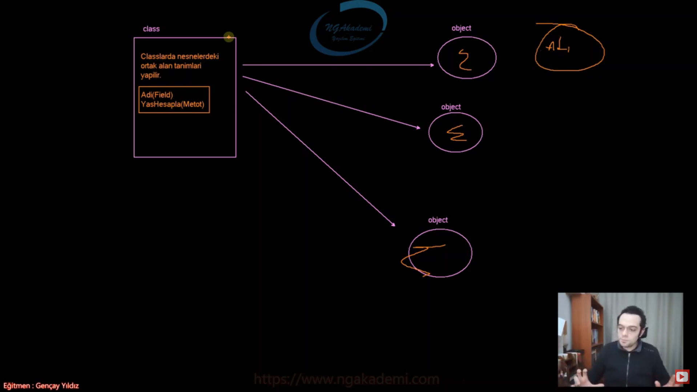

# -CLASS-

## Sinif Nedir ? Neden Sinif Yapisi Kullanilir?

* oop'de bir object oluşturabilmek için öncelikle  objectin modellenmesi tanimlanmasi gerekmektedir.
* bir objenin modelini/taniminin olusturablmek için class yapisi kullanilir.


***

## Sinif İle Nesne Arasindaki İlişki Nedir?

* claslarda nesnelerdeki ortak alan tanimlari yapilir.
* sinif nesnelerin türetildiği yapıdır.
* bir sinifin birden fazla nesnesi olabilir



***

## Sinif Nasil ve Nerede Oluşturulur

* Classlar bir referans türüdür.
* Bir class tanımlamasında tanımlanan yerde(namespace, namespace/dışı, class) aynı isimde birden fazla class tanimlanamaz!
* Sınıf 3 farklı yerde oluşturulur
    **1.NameSpace İçerisinde**
    ``` csharp
    namespace deneme
    {
        class MyClass
        {

        }
    }
    ```
    **2.NameSpace Disarisinda**
    ``` csharp
    namespace deneme
    {
        
    }
    class MyClass
    {
            
    }
    ```
    **3.Class İçerisinde(Nested Type)**
    ``` csharp
    class MyClass
    {
        class MyClass2
        {

        }
    }
    ```

***

## Sinif İle Nesne Modeli Tasarlama

* OrnekModel diye bir örnek yapalım 
``` csharp
    class OrnekModel
    {
        int a;
        int b;
        public void X()
        {
            Console.WriteLine(a + " " + b);
        }
        public int Y()
        {
            return a * b;
        }
    }
```

***

## Sinif Modelinden Referans Noktasi Oluşturma

* referans, stackte tutulan ve heapteki herhangi bir nesneyi işaretleyebilme özelliğine sahip değişken türü. İşte biz buna değişken türü demiyoruz referans noktasi diyoruz

<div style="display: flex; justify-content: space-around;">
  
  
</div>
<br>

* Bir class tanımlandığında o class adi bir türdür. Haliyle o türü kullanabilmek için direkt olarak class adını kullanmamız yeterlidir.


