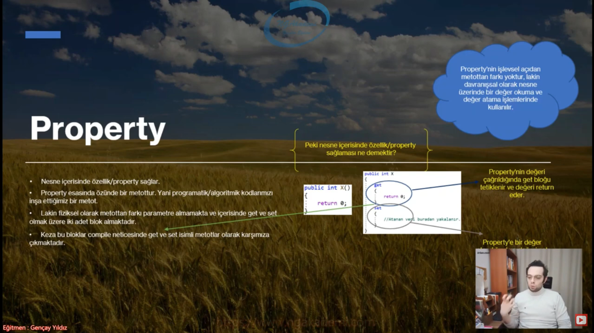
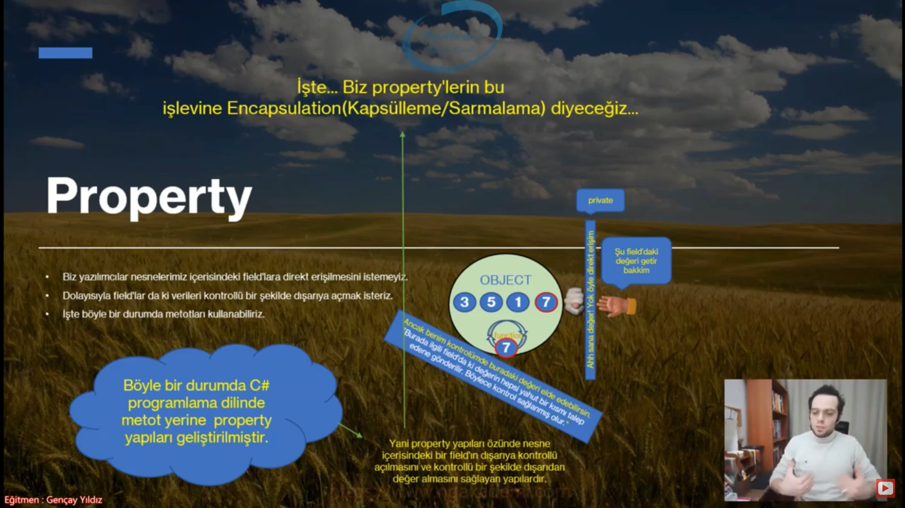
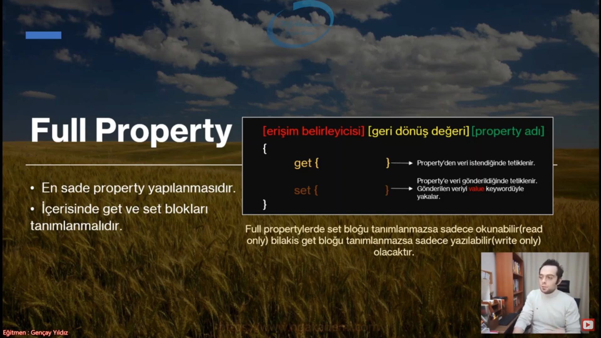
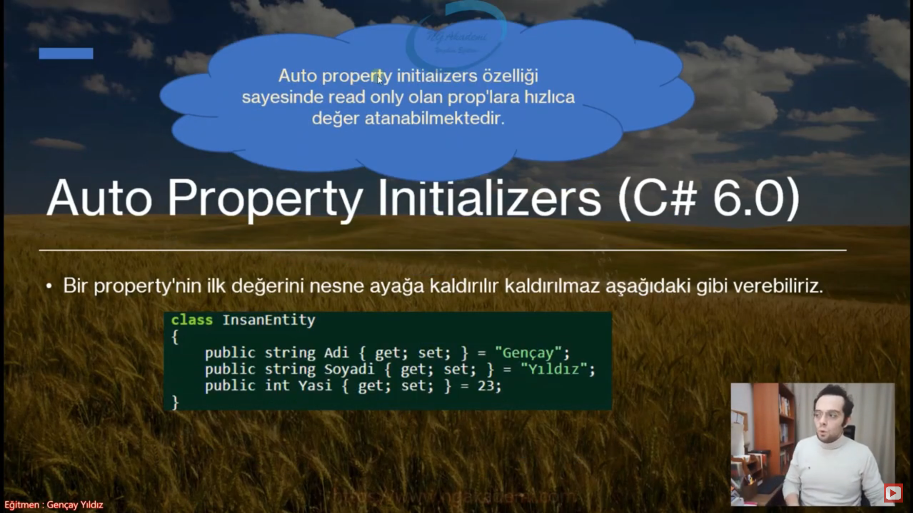
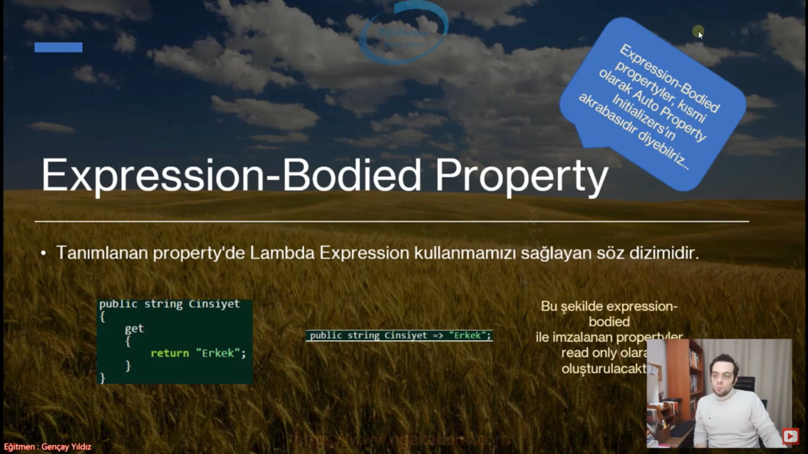
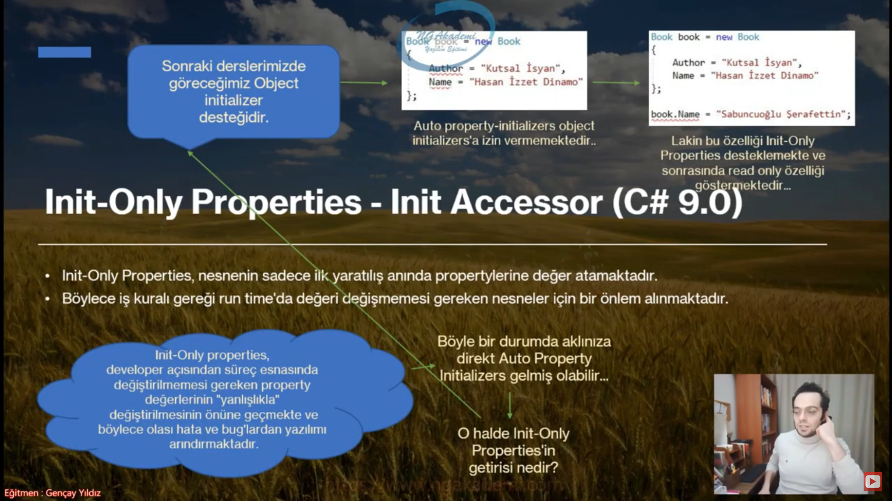
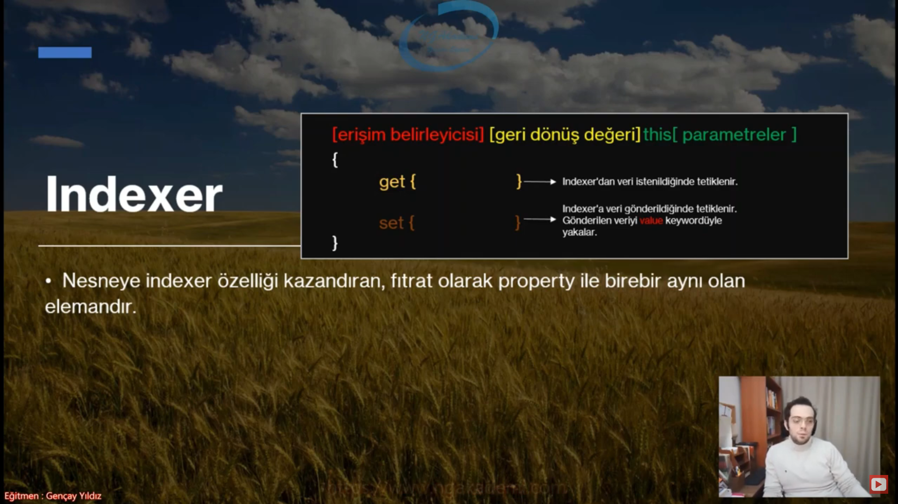

# Class Members

## Field

* Nesne içerisinde veri depoladığımız alanlardır.
* Class içerisindeki değişkenlerdir.
* Herhangi bir türden olabilirler
* Fieldlar başlangıçta kendi türününü default değerini alırlar


## Property

* Nesne içerisinde özellik sağlar
* Property esasında özünde bir metottur. Yani programatik kodlarımızı inşa ettiğimiz bir metottur.
* Property içinde iki tane metot barınıdırır biri __get__ biri __set__
* get metodu propertyinin değerini çağırıldığında tetiklenip değeri return eder
* set metodu propertye değer atandığında çağrıılıp tetiklendiğinde assign edier.



---

### Peki ne işe yaramata bu property

* Biz yazılımcılar nesnelerimiz içerisindeki field'lara direkt erişilmesini istemeyiz.
* Dolayısıyla field'lar da ki verileri kontrollü bir şekilde dışarıya açmak isteriz
* İşte böyle bir durumda metotları kullanabiliriz
* c# ta bize özel metot kullanmana gerek yok propertyleri kullan diyor bu işlem için
* Yani property yapıları özünde nesne içerisindeki bir field'ın dışarıya kontrollü açılmasını ve kontrollü bir şekilde dışarıdan değer almasını sağlayan yapılardır
* İşte... Biz propertylerin bu işlevine Encapsulation(Kapsülleme/Sarmalama) diyeceğiz.



---

## Encapsulation

* Encapsulation, bir nesne içerisindeki dataların(yani field'lardaki verilerin) dışarıya kontrollü bir şekilde açılması ve kontrollü bir şekilde veri almasıdır
* __For Example :__ Bir çocuk düşünelim bu çocuk yaramazlık yapıyor sizde çocuğa çok kızıyorsunuz gidip babasına söylüyorsunuz babasıda sizden gelen tepkiye göre gidip çocugunu uyarıyor veya cezalandırıyor bunu fielda değer ataması gibi düşünebiliriz adamın tepkisini babası uyarlayıp çocuga öyle yansıtıyor. Diğer türlüde çocuk diyelimki kötü bir söz söyledi lakin babası diyorki aslında öyle söylemek istemedi şunu söylemek istedi bunuda fielddan değer almak gibi düşünelim baba gene çocugun sözlerini uyaralyıp dışarıya o şekilde gösteriyor İki işlemdede baba kapsülleme yapıyor
* İşte bu şekilde field'lardaki verilerin erişim kontrolünü yapmamız için geliştirilmiş olan yapılara __Property__ denmektedir


---

## Property İmzaları

* Property yapısı oluşturabilmenin yapısal olarak birkaç farklı yolu vardır
    * Full Property
    * Prop
    * Auto Property Initializers
    * Ref Readonly Returns
    * Computed(Hesaplanmış) Properties
    * Expression-Bodied Property
        * Read Only Property
    * Init-Only Properties ve Init Accessor

    ### Full property

    * En sade property yapılanmasıdır
    * İçerisinde get ve set blokları tanımlanmalıdır.
    * Full propertylerde set bloğu tanımlanmazsa sadece okunabilir bilakis get bloğu tanımlanmazsa sadece yazılabilir olacaktır.

    

    --- 

    ### Prop Property

    * Bir property her ne kadar encapsulation yapsada temsil ettiği field'da ki dataya hiç müdahale etmeden erişilmesini ve veri atanmasını sağlıyorsa böyle bir durumda kullanılan property imzasıdır.
    * Prop propertyler compile edildiklerinde arkaplanda kendi field'larını oluştururlar. Dolayısıyla bir field tanımlamaya gerek yoktur!
    * Peki böyle bir durumda direkt field'a erişim sağlayamaz mıyız ?
    * HAYIR! Field'da ki değere müdahale olsun olmasın direkt erişim yapılmasını istemiyoruz. Bu alışkanlığımız olsun
    * Haliyle böyle bir durumda yine property kullancağız. Sadece get ve set blokları aşağıdaki gibi tanımlanması yeterli olacaktır.
    * ! Prop imzalarda ilgili property read only olabilir lakin write only olmaz!

    

    ---

    ### Auto Property Initializers(C# 6.0)

    * Bir property'nin ilk değerini nesne ayağa kaldırır kaldırmaz aşağıdaki gibi verebiliriz

    ``` csharp
    class InsanEntity
    {
        public string Adi { get; set; } = "Mustafa";
        public string Soyadi { get; set; } = "Ünal";
        public string Yasi { get; set; } = 23;
    }
    ```
    * Auto property initializers özelliği sayesinde read only olan prop'lara hızlıca değer atanabilmektedir.

    

    ---
    
    ### Ref Readonly Returns(C# 7.2)

    * ref readonly returns, bir sınıf(class) içerisindeki field'ı referansıyla döndürmemizi sağlayan ve biryandan da bu değişkenin değerini read only yapan özelliktir.

    

    ---

    ### Computed(Hesaplanmış) Property

    * İçerisinde türetilmiş bir bağıntı taşıyan property'lerdir

    

    ---

    ### Expression-Bodied Property

    * Tanımanan property'de Lambda Expression kullanmamızı sağlayan söz dizimidir.
    * sadece read onlyde kullanılıyor.

    

    ---

    ### Init-Only Properties - Init Accessor(C# 9.0)


    

## Metot

* Nesne üzerinde, field'larda ki yahut dışarıdan parametreler eşliğinde gelen değerler üzerinde işlemler yapmamızı sağlayan temel programatik parçalardır.

## Indexer

* Nesneye indexer özeliği kazandıran, fıtrat olarak property ile birebir aynı olan elemandır.
* this property kullanmak zorundayız




    