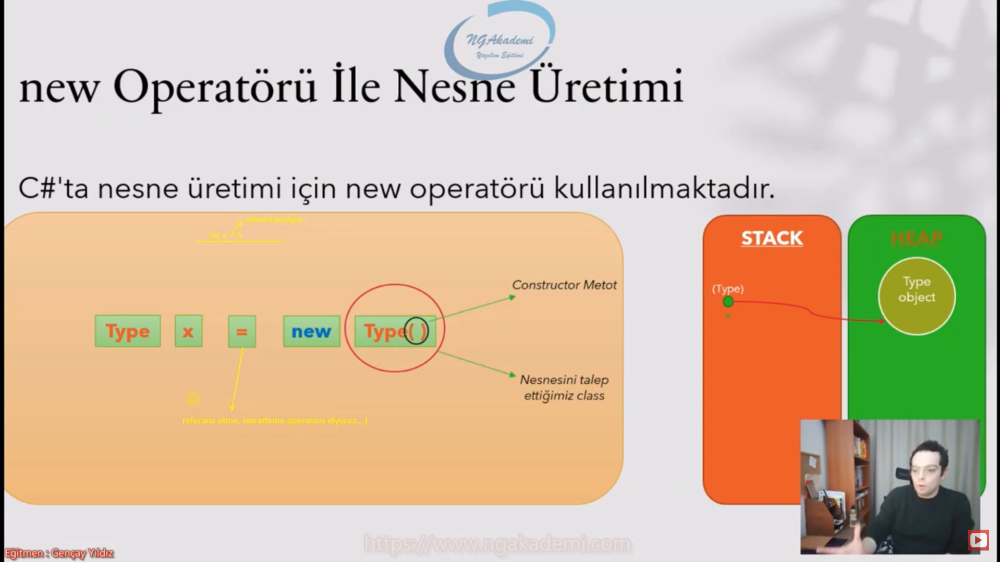
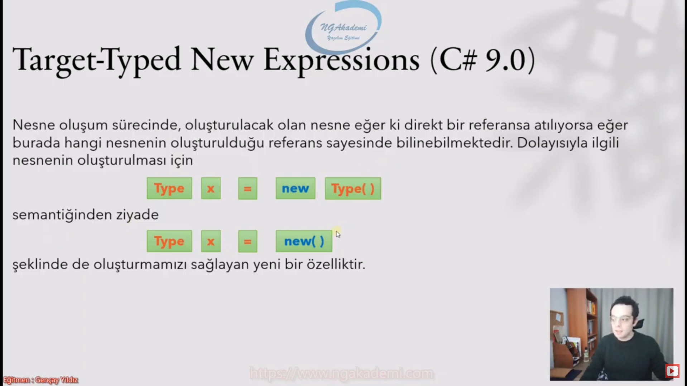

# Nesne

## Nesne Nedir

* Nesne complex typelardır
* İçerisinde birden fazla türü barındıran bir yapıdır
* Gerçek hatakki bir oluşumu kod içinde modellemizie sağlayan bir araçtır

## New Operatörü İle Nesne Üretimi

## Target-Typed New Expressions C# 9.0

