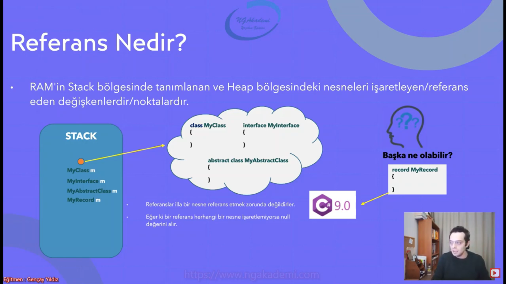
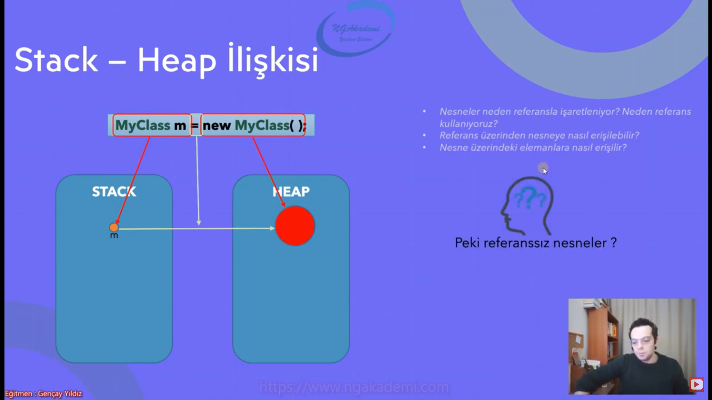
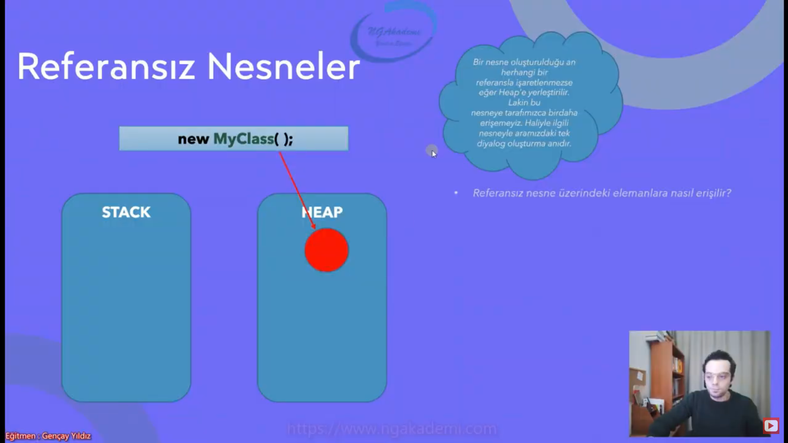

# Referans Nesne İlişkisi

## Referans Nedir?

* RAM'in Stack bölgesinde tanımlanan ve Heap bölgesindeki nesneleri işaretleyen/referans eden değişkenler/noktalardır.



## Stack - Heap İlşkisi



## Referanssız Nesneler

* bir nesneye erişebilmenin tek yolu tanımlandığı andır onun dışında erişemeyiz
* Eğer ki bir nesne referanszisa bunu oluşturabilmekteyiz. Lakinbu nesne sistemde/memoryde lüzümsuz yer kaplayacağından dolayi belli bir süre sonra Garbage Collector dediğimiz çöp toplayıcısı tarafından temizlecnektir.
* referansı olmayan nesneler Garbage Collector ile temizlenmektedirler.
* GC; heap'de referanszi olan nesneleri imha etmekten/temizlemekten sorumlu bir yapılanmadır.



## Object Initialize İle Nesne Oluşturma Esnasında Propertylere İlk Değeri Atama

```csharp
class MyClass
{
    public int MyProperty { get; set; }
    public int MyProperty2 { get; set; }
    public int MyProperty3 { get; set; }
}

MyClass m1 = new MyClass();
m1.MyProperty = 10;
m1.MyProperty3 = 20;
m1.MyProperty2 = 30;

yerine 

MyClass m2 = new MyClass()
{
    MyProperty = 10,
    MyProperty2 = 20,
    MyProperty3 = 30
}

şeklinde kullanılabilir.
```


