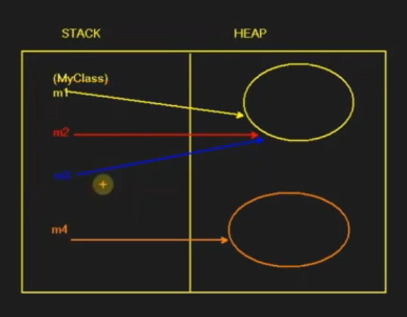

# Nesne Kopyalama Davranislari

## Nesne & Değer Kopyalamadan Kastedilen Nedir?

* Nesne kopyalama özünde iki davranış üzerinden seyreder

### Shallow Copy

* Var olan bir nesnein, değerinin, referansının kopyalanmasıdır. Shallow copy neticesinde eldeki değer çoğaltılmaz. Sadece birden fazla referansla işaretlenmiş olur
* Nesne tek lakin işaretleyen referans sayisi birden fazla

```csharp
MyClass m1 = new MyClass();
MyClass m2 = m1;
MyClass m3 = m2;
MyClass m4 = new MyClass();
```



### Deep Copy

* Var olan bir nesne, deep copy ile kopyalanıyorsa eğer ilgili nesne miktarı çoğalır. Aynı özelliklere ve değerlere sahip olan bellekte farklı bir nesne daha oluşur.

#### Nesne Üzerinde DeepCopy Yapma

* nesne üzerinde direkt bir deep copy yapamyız bunun için bir yapı inşa etmemiz lazımdır.
* bu işlemi yapmamızı yarayan yapıda kullancağımız metot => MemberwiseClone'dir.
* __MemberwiseClone__, bir sinifin içerisinde o sinifran üretilmiş olan o anki nesneyi clonelamamizi sağlayan bir fonksiyonudr(objcet olarak döner)

```csharp
class MyClass
{
    public MyClass Clone()
    {
        return (MyClass)this.MemberwiseClone();
    }
}

MyClass m1 = new MyClass();
MyClass m2 = m1; // shallow copy
MyClass m3 = m1.Clone(); // deep copy
```


