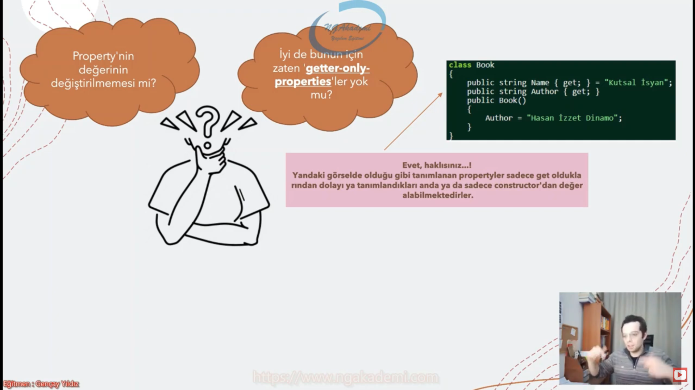

# RECORD

## Record'ı Anlayabilmek İçin Ön Hazırlık(Init-Only Properties)

* C# 9.0'da, herhangi bir nesnenin propertylerine ilk değerlerinin verilmesi ve sonraki süreçte bu değerlerin değiştirilmemeisini garanti altına almamızı sağlayan Init-Only Properties Özelliği gelmiştir.
* Bu özellik sayesinde nesnenin sadece ilk yaratılış anında propertylerine değer atanmakta ve böylece iş kuralları gereği runtime'da değeri değişmemesi gereken nesneler için ideal bir önlem alınmaktadır.

* Init-Only properties, developer açısından süreç esnanında değiştirilmemesi gereken property değerlerinin - yanlışıkla - değiştirilmesinin önüne geçmekte ve böylede olası hata ve buglardan yazılımı arındırmaktadır.

* __Init Only Properties__ => elimizdeki propertyleri readonly yapar hemde nesnenin ilk yaratılış anındaki object initalizer dediğimz anda ilk değeri vermemizi sağlar.

---

## Init-Only Properties Tanımlama

* Init-Only Properties özelliğine 'init' keyword'ü eşlik etmektedir

---

## Records Nedir ?

* Nesne ön plandaysa bu class, nesnenin değerleri ön plandaysa bu record'dur.

## Record Tanımlama

## Record İle Class Arasındaki Fark Kritiği Yapalım

## With Expressions

