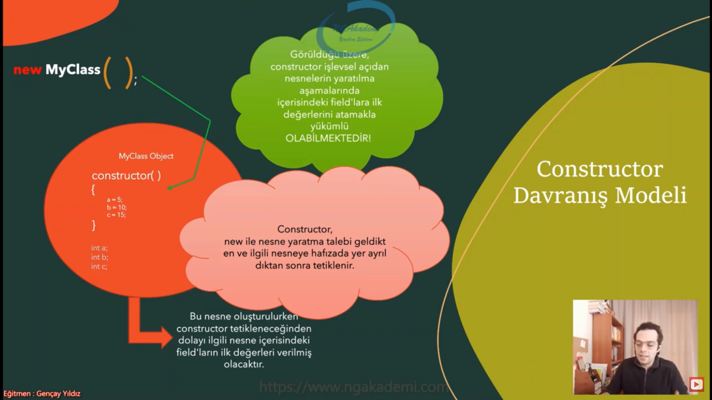

# Constructor

## Constructor Nedir?

* Constructor bir nesne üretimi sürecinde ilk tetiklenen metottur.
* Constructer, nesne oluştruma sürecinde tetiklenmek zorundadır!.

```csharp
..... new MyClass()  // ()=> constructor metot
```

## Constructor Davranış Modeli



## Constructor Metot Nasıl Oluşturulur?

* Constructor, özel bir sınıf elemanıdır.
* Özel olsada fıtrat olarak bir metottur.
* Lakin bildiğimiz metot imzalarından bir nebze farka sahiptir.
* Constructor'ların;
    * Metot adı sınıf adıyla aynı olmalıdır! ( Özel sınıf elemanlarının dışında hiçbir member sınıf adıyla aynı olamaz!)
    * Geri dönüş değeri olmaz/belirtilmez!
    * Erişim belirleyicisi public olmalıdır! (private olduğu durum ayriyetten incelenecektir)

```csharp
class MyClass
{
    public MyClass()
    {
        // constructor metot
    }
    public void X()
    {

    }
}
```


## Default Constructor

* Her sınıfın içerisinde tanımlamasak dahi default bir constructor mevcuttur.
* Herhangi bir class'ı içi boş bir şekilde ele alalım;

```csharp
class MyClass
{
    // Bu sınıf içerisinde herhangi bir ctor tanımlanmamış olabilir
}
new MyClass(); // => Lakin nesne üretirken de ctor tetiklenmketedir.
```

* Eğer ki bir class' a constructor eklersek default constructo'ı ezmiş oluruz.

## Parametreli Construtor

```csharp
class MyClass
{
    public MyClass(int value)
    {
        Console.WriteLine("deneme" + value);
    }
}
new MyClass(5); // => deneme 5
```

## Constructor Overload

* Constructor overloading yapılabilir fonksiyonlardır.
* Bir sınıf içerisinde aynı isimde birden fazla members olamaz. Eğerki bir sınıf içeriisnde aynı isimde birden fazla metot oluşturacaksak overloading yapıcaz yani imza yapılarını değiştireecz.

```csharp
class MyClass
{
    public MyClass()
    {
        Console.WriteLine("deneme");
    }
    public MyClass(int value)
    {
        Console.WriteLine("deneme " + value);
    }
    public MyClass(string value)
    {
        Console.WriteLine("deneme " + value);
    }
    public MyClass(string value,int value2)
    {
        Console.WriteLine("deneme " + value + " " + value2);
    }
}
new MyClass(); // => deneme 
new MyClass(5); // => deneme 5
new MyClass("deneme"); // => deneme deneme
new MyClass("deneme",4); // => deneme deneme 4
```

## Constructor'ın Erişim Belirleyicisini private Yaparsak Sorunsalı?

* eğerki ctorun erişim belirleyicisini private yaparsak o class için dışardan nesne üretimini engellemiş oluruz. Lakin sınıfın kendi classında hala nesne üretebilmekteyiz

## this Keywordüyle Constructor'lar Arası Geçiş

```csharp
class MyClass
{
    public MyClass()
        {
            Console.WriteLine("1. Contructor");
        }
        public MyClass(int a) : this()
        {
            Console.WriteLine($"2. Contructor : a = {a}");
        }
        public MyClass(int a,int b) : this(a)
        {
            Console.WriteLine($"3. Contructor : a = {a} | b = {b}");
        }
}
public MyClass(int a) : this() // => buradaki this() keyowrdü classın diğer constructorlarına erişmemizi olanak sağlamaktadır

// ve bu şu anlama gelmektedir 
// eğerki public MyClass(int a) : this() 
// constructor tetikleniyorsa bu ctor işlemini görmeden önce thisteki ctoru tetikleyecektir

// Ornek
new MyClass(5);
// => 1. Contructor
//    2. Contructor : a = 5

// Ornek 
ne MyClass(5,10)
// => 1. Contructor
//    2. Contructor : a = 5
//    3. Contructor : a = 5 | b = 10
```

* Yukarıdaki örneklerde dikkat etmemiz gereken bir kısım ise this() keywordüne yani manuel elle değer verecez yada ctorun parametresindeki değerleden değer verebileceğiz onun dışında başka şekilde değer veremeyiz.

## Recordlarda Constructor

* classtaki şeyler recordda'da geçerlidir.