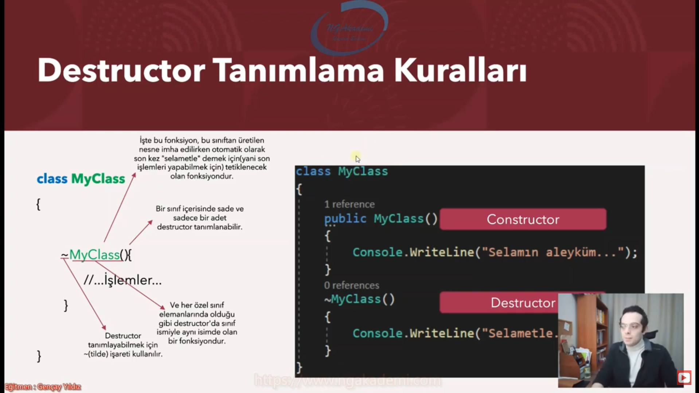

# Destructor/Finalizer 

## Destructor/Finalizer Metot Nedir?

* Bir class'tan üretilmiş olan nesne imha edilirken otomatik çağrılan metottur.
* C# programlama dilinde Destructor sadece class yapılanmasında kulanılabilir ve bir class sade ve sadece bir tane Destructor içerebilmektedir
* Parametre alamaz

## Destructor Davranış Modeli

* Oluşturulan bir nesne ile işimiz bitince o nesneyi imha etmemiz gerekir çünkü bellekte boş yere yer tutacaktır.
* Burada yıkıcı fonksiyon olan destructor metot devreye girecektir.

## Peki Bir Nesne Hangi Şartlarda,Kim Tarafından İmha Edilir?

* Bir nesnenin imha edilmesi için;
    * İlgili nesne herhangi bir referans tarafından işaretlenmemelidir.
    * Yahut nesnenin oluşturulduğu ve kullanıldığı scope sonra ermiş olmalıdır.
    * Yani anlaşılan ilgili nesneye bir daha erişilemez hale gelinmelidir.

işte  o zaman nesne imha edilir.

 __PEKİ KİM TARAFINDAN?__

 ## Garbage Collector

 * Uygulamada lüzumsuz olan nesneleri toplamak için Garbage Collector isimli bir mekanizma devreye girer.
 * Esasında Garbage Collector C#'da bellek optimizasyonunu üstlenen bir yapılanmadır.
 * C#'da Garbage Collector'ın ne zaman iş göreceği tahmin edilemez. Kafasına göre takılır :)
 * Dolayısıyla biz geliştiricilerin bu mekanizmaya müdahale etmesi pek önerilmez.

 ## Destructor Tanımlama Kuralları

 
 

