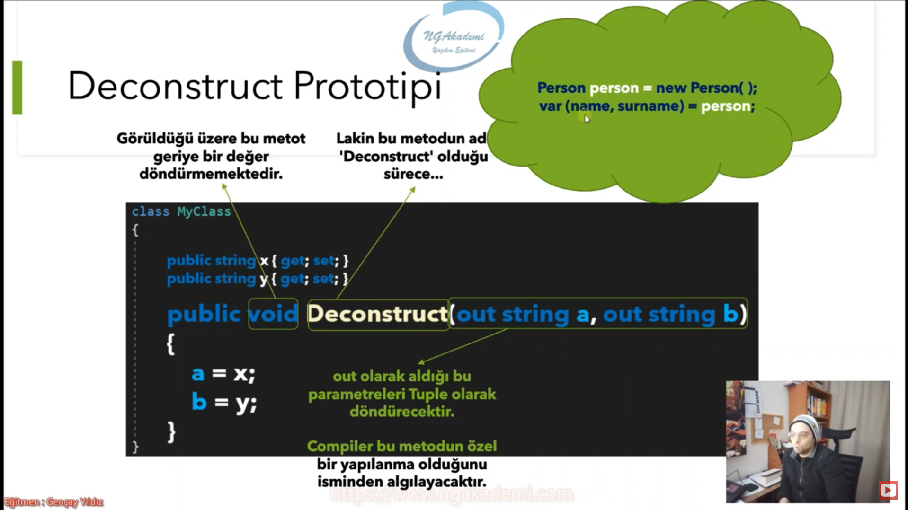

# Deconstruct

## Deconstruct Metodu Nedir?

* Bir sınıf içerisinde "Deconstruct" ismiyle tanımlanan metot, compiler tarafından özel olarak algılanmakta ve sınıfın nesnesi üzerinden geriye hızlıca Tuple bir değer döndürmemizi sağlamaktadır.
* Diğer özel class memberları class ismiyle tanımlanırken Deconstruct kendi ismiyle tanımlanır.

