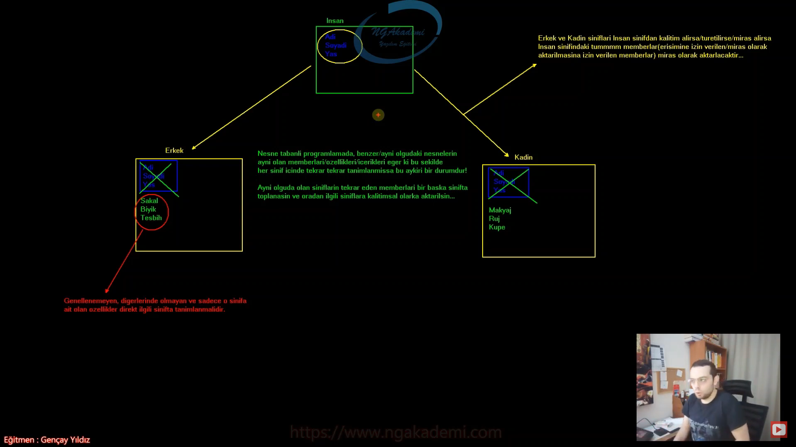
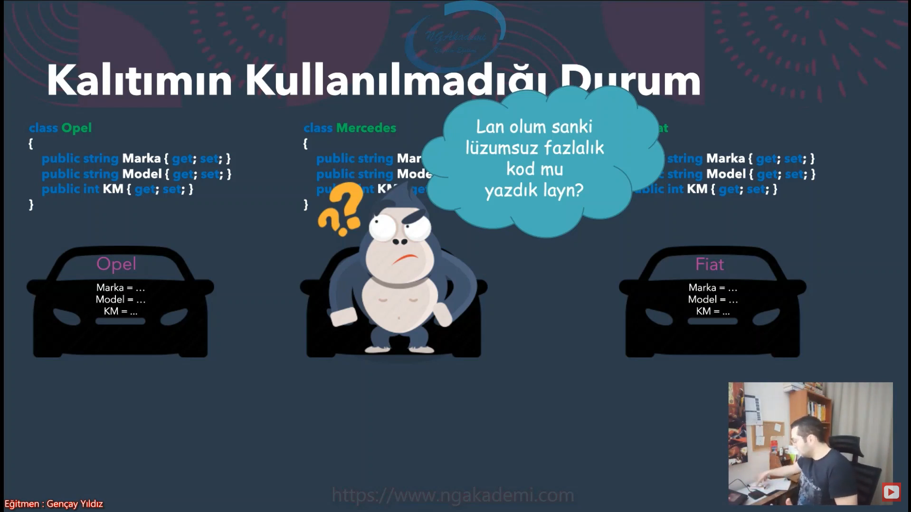
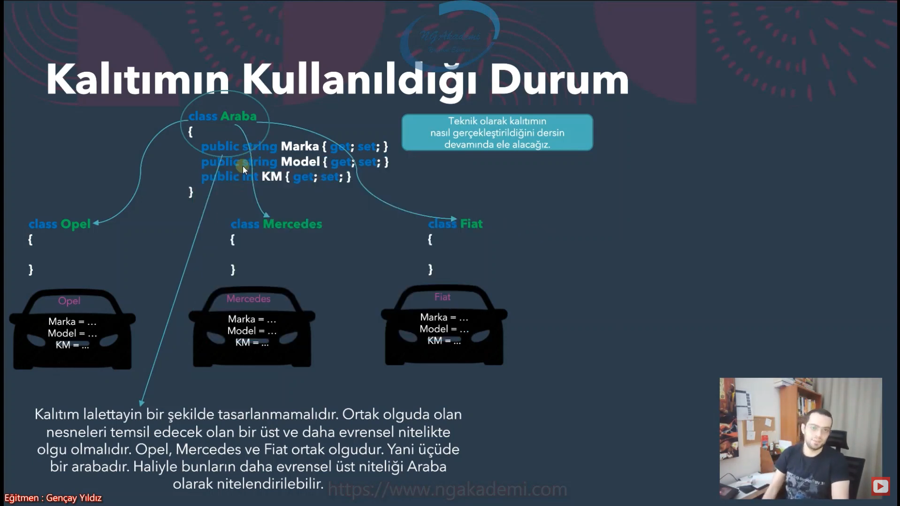
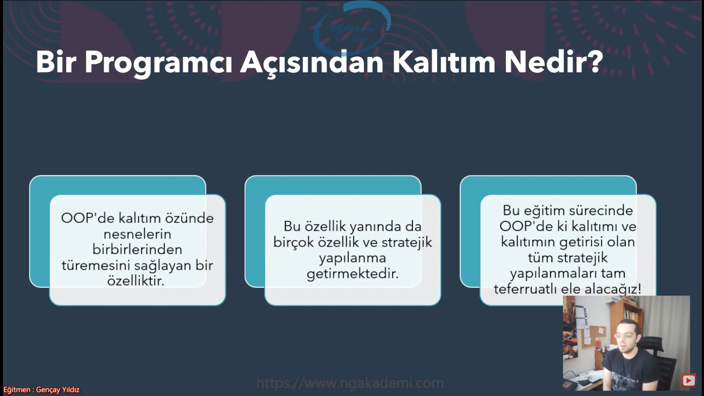
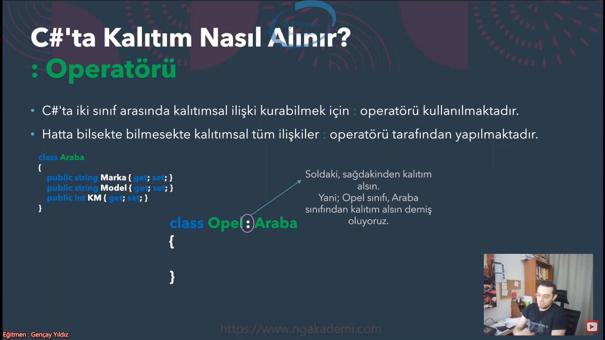

# Inheritance

## Bir Programcı Açısından Kalıtım Nedir?

* Kalıtım OOP'nin en önemli özelliğidir.
* Üretilen nesneler farklı nesnelere özelliklerini aktarabilmekte ve böylece hiyerarşik bir düzenleme yapılabilmektedir.
* Bir programcı açısından bu özellik;
    * Aynı aile grubundan gelen nesnelerin ya da tayayda eşit seviyede olan tüm olguların benzer özelliklerini tekrar tekrar herbirinde tanımlanmaktansa bir üst sınıfta tanımlanmasını ve her bir sınıfın bu özellikleri üst sınıftan kalıtımsa olarak almasını sağlar
    * Böylece hem kod maliyeti düşmekte, hem de mimarisal tasarım açısından avantaj sağlanmaktadır.

### Kalıtımın Kullanılmadığı Durum

### Kalıtımın Kullanıldığı Durum

* Heh şimdi oldu! Aynı kodları tekrar tekrar tüm sınıfta yazmaktansa kalıtımdan faydalanmak en doğrusu
* Kalıtım operasyonunda, kalıtım veren sınıfın erişilebilen tüm memberları kalıtım alan sınıfa kalıtsal olarak aktarılacaktır.

## Şimdi tekrardan Bir Programcı Açısından Kalıtım Nedire Geri Dönelim

## C# Programlama Dilinde Hangi Yapılar Kalıtım Alabilirler?

* C# programlama dilinde kalıtım sınıflara özel bir niteliktir.
* Yani bir sınıf sade ve sadece bir sınıftan kalıtım alabilir.

    ### Peki Recordlar kalıtım alabilirler mi?

    * Evet, record'lar da kalıtım alabilmekte. Lakin kendi aralarında. Kalıtım alabildikleri tek istisnai sınıf ise ileride göreceğimiz __Object__ sınıfıdır.
    * __Object__ => kalıtımda önemli bir rol oynayan özel bir sınıftır ilerde göreceğiz.

* Sonraki derslerimizde göreceğimiz abstract class, interface ve struct gibi yapılarında kendilerine göre kalıtımsal operasyonları mevcuttur. Bu yapılardaki kalıtımsal detaylar ilgili derslerde ele alınacaktır.

## C#'ta Kalıtım Nasıl Alınır?

