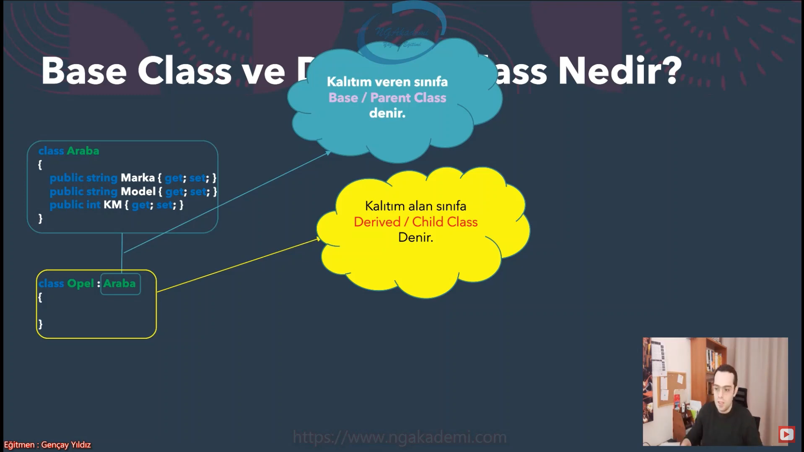
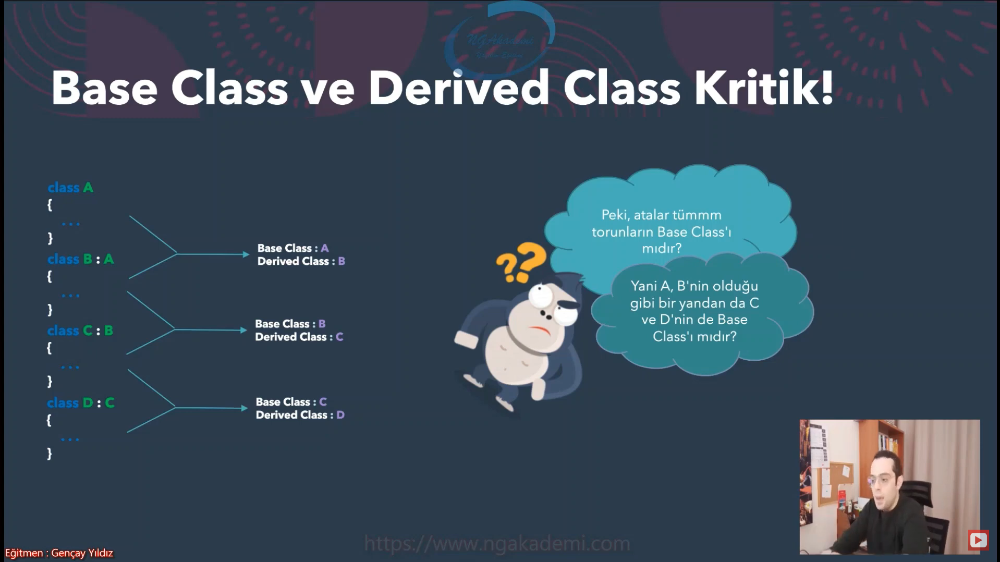
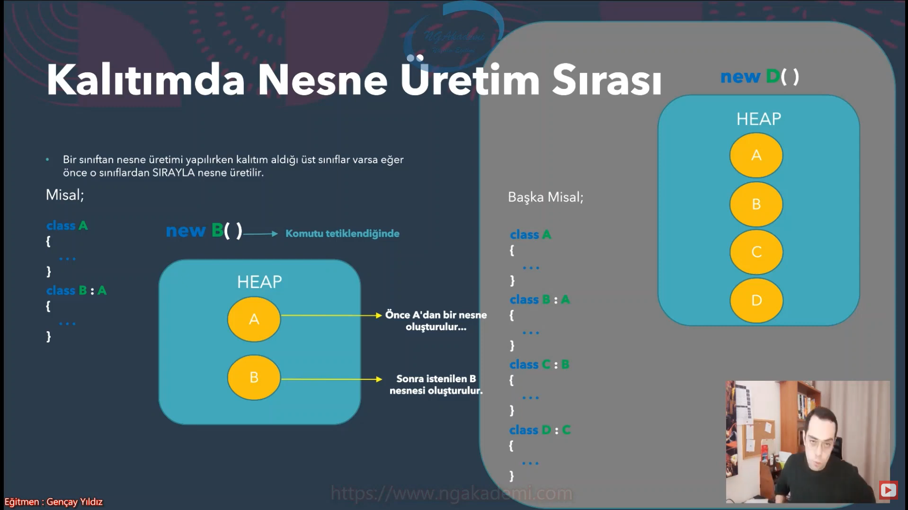
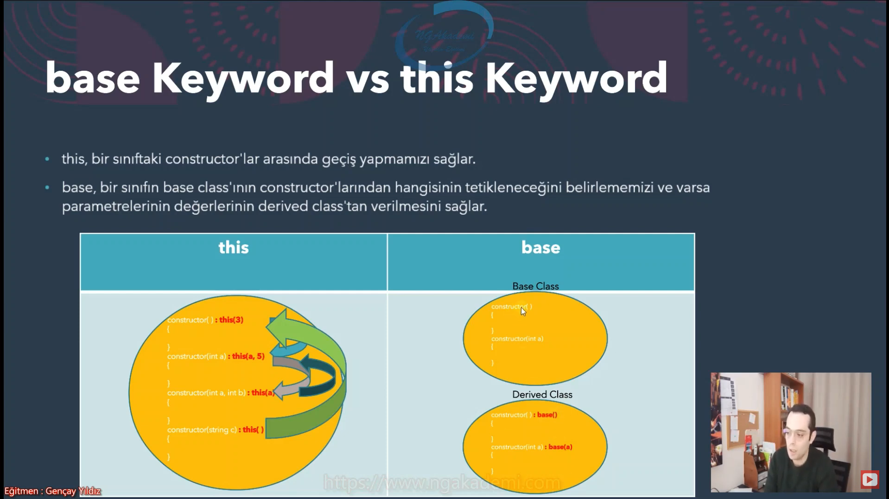
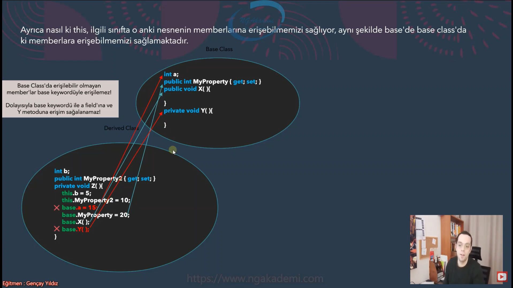

# Inheritance Part2

## Base Class ve Derived Class Nedir?




 
* Yukarıdaki sounun cevabı HAYIR'dır.
* Unutma ! Bir sınıfın sade ve sadece bir tane base classı vardır..
* Yani bir sınıfın Base Clas'ı direkt türediği sınıftır.
* Lakin atalarındaki tüm sınıflar Base Class'ı değildir
* Örneğin; C'nin Base Clas'ı B'dir. A ise atasıdır lakin base classı değildir.
* Peki müdür, bir classın biden fazla Derived Class'ı olabilir mi? ==> EVET, şöyle düşünün benim bir tane babam vardır ama babamın birden fazla evladı olabilir

## Kalıtımın Altın Kuralı

* Bir class'ın sade ve sadece bir Base Class'ı olur dedik.
* Bunun nedeni, C# programlama dilinde bir class'ın sade ve sadece tek bir class'tan türetilmesine izin verilmektedir! Aynı anda birden fazla class'tan türeme işlemi gerçekleştirilemez.
* İleride bu şekilde birden fazla kalıtım tanımlamasının yapılabildiğini göreceksiniz. Lakin orada da göreceksiniz ki Z ve W bir sınıf olmayacaktır.(İpucu : Interface)

## Kalıtımda Nesne Üretim Sırası



* Yani buradan anlaşılıyor ki, bir sınıftan nesne üretilirken siz 1 adet nesne ürettiginizi düşünsenizde kalıtımsal açıdan birden fazla nesne üretimi gerçekleştirilebilmektedir.

## Bir Sınıftan Base Class Constructor'ına Ulaşım

* Madem ki, herhangi bir sınıftan nesne üretimi gerçekleştirilirken öncelikle base class'ından nesne üretiliyor, bu demektir ki önce base class'ın constrctor'ı tetikleniyor.
* Haliyle bizler nesne üretimi esnansında base Class'ta üretilecek olan nesnenin istediğimiz constructor'larını tetikleyebilmeli yahut varsa parametre bu değerleri verebilmeliyiz.
* İşte bunun için __base Keyword__'ünü kullanmaktayız.

```csharp
class MyClass
{
    public MyClass(int a)
    {
    }
}
class MyClass2 : MyClass
{
    public MyClass2() : base(5)
    {
    }
}
```
* şimdi yukarıdaki örnek gördüğümüz gibi eğerki bir MyClass2 den bir nesne üretirsek öncelikle MyClass oluşturulacak sonra MyClass2 oluşturulack. Lakin MyClass ın constructor'ı bir parametre almaktadır benimde bu parametreyi child classtan bir şekilde göndermem lazım işte burada yardımızıa __base()__ keywordü giriyor.

```csharp
class MyClass
{
    public MyClass()
    {
    }
    public MyClass(int a)
    {
    }
}
class MyClass2 : MyClass
{
    public MyClass2()
    {
        // burası için
    }
    public MyClass2(int a) : base(a)
    {
    }
}
```

* Eger ki base class'ta boş parametreli bir constructor varsa derived classta base ile bir bildirimde bulunmak zorunda değiliz.
* Çünkü varsayilan olarak kalitimsal durumda base classta ki bos parametreli constructor tetiklenir.

* Bir classin constructorinin yanında : base(...) keywordünü kullanirsak eger o class'in base classının tüm constructorlarını bize getirecektir. Haliyle ilgili siniftan bir nesne üretilirken base classtan nesne üretimi esnasında hangi constructorin tetiklenecğinni bu sekilde belirleyebiliriz.
* base keywordü bir classın constructor'ın yanında kullanıldığında ilgili classın base classın constructorlarını bize getirir.

## base Keyword vs this Keyword

* this, bir sınıftaki constructor'lar arasında geçiş yapmamızı sağlar.
* base, bir sınıfın base class'ının constructor'larından hangisinin tetikleneceğini belirlememizi ve varsa parametrelerinin değerlerinin derived class'tan verilmesini sağlar.



* Ayrıca nasıl ki this, ilgili sınıfta o anki nesnenin memberlarına erişebilmemizi sağlıyor, aynı şekilde base'de base class'da ki memberlara erişebilmemizi sağlamaktadır.

