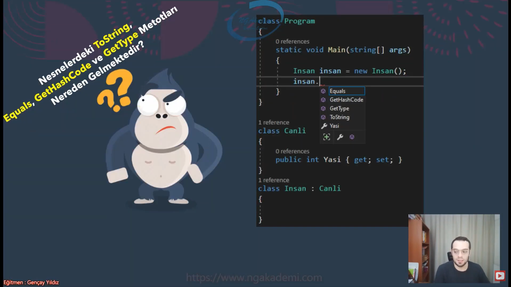
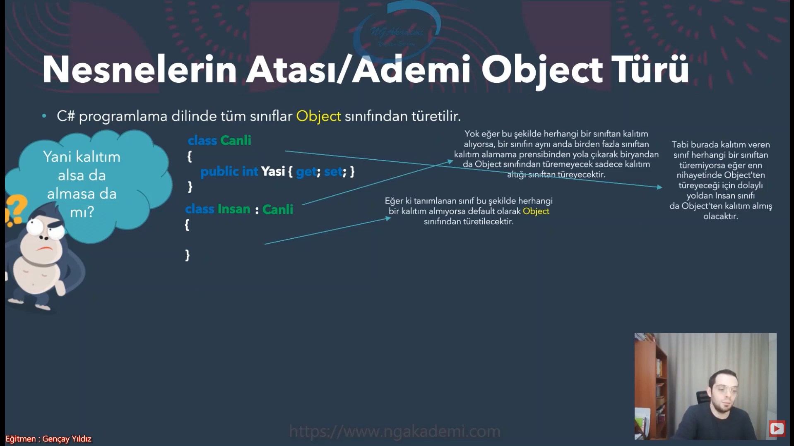
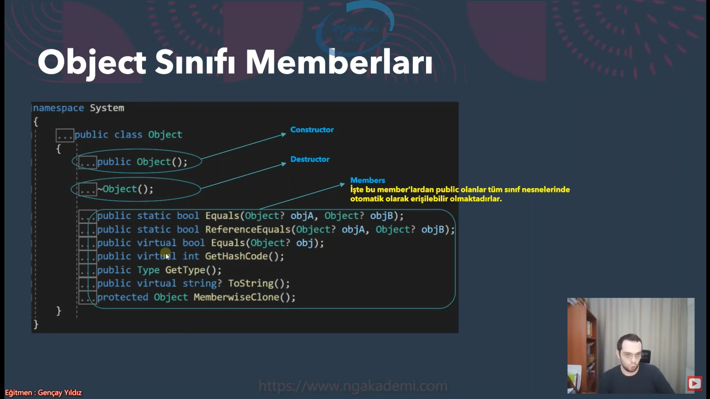
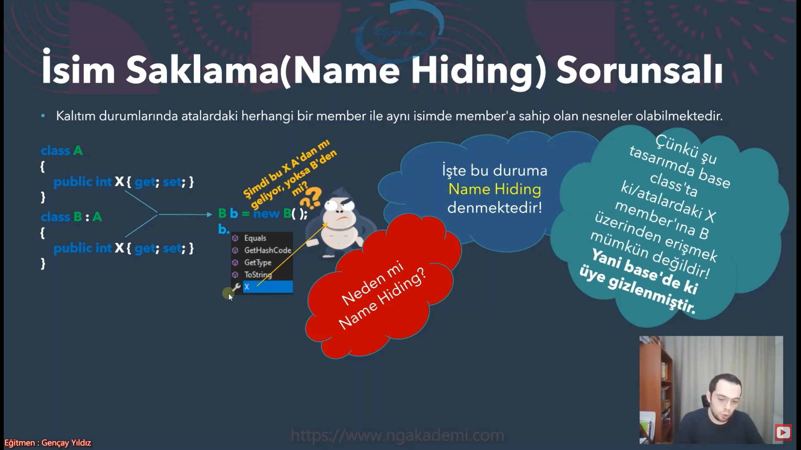
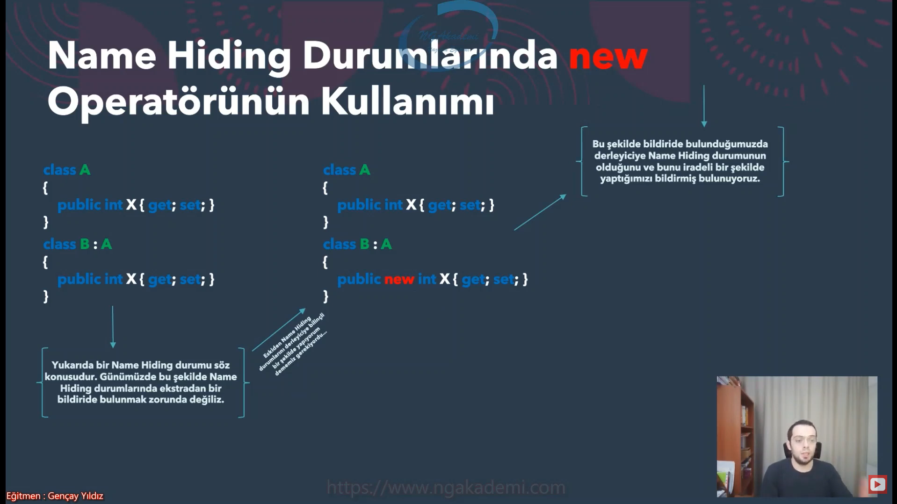

# Inheritance Part3

## Nesnelerin Atası/Ademi Object Türü

* C# programlama dilinde tüm sınıflar __Object__ sınıfından türetilir.

* Yani en nihayetinde bir sınıf öyle ya da böyle Object sınıfından kalıtım alacaktır.

## Object Sınıfı Memberları

## İsim Saklama(Name Hiding) Sorunsalı

* Kalıtım durumlarında atalardaki herhangi bir member ile aynı isimde member'a sahip olan nesneler olabilmektedir.

* Bu durumda derleyici bir hata vermez
* Fakat bir warning/uyari verecektir.
    * 'B.X' hides inherited member 'A.X'. Use the new keyword if hiding was intended.
* Görüldüğü üzere B sınıfının base class'ta ki gizleyeceğini ifade etmekte ve gizlenmesi için ise new keywordünün kullanılması gerektiğini söylemektedir.
* Evet, eskiden name hiding durumlarında alt sınıfın içerisindeki üyeyi new ile işaretliyoduk.
* Günümüzde buna ihtiyaç yoktur
* İhtiyaç yoktur lakin biz yine de Nama Hiding durumlarında new operatörünün kullanımını inceleyelim...

### New Hiding Durumlarında new Operatörünün Kullanımı

* Günümüzde buna ihtiyaç yoktur.

## Record'larda Kalıtım

* Record'lar sade ve sadece Record'lar dan kalıtım alabilmektedirler.
* Class'lar dan kalıtım alamazlar yahut veremezler!
* Kalırımın tüm temel kuralları record'lar için geçerlidir;
    * Bir record aynı anda birden fazla record'dan kalıtım alamaz!
    * Record'lar da temelde class oldukları için üretilir üretilmez otomatik olarak Object'ten türerler.
    * base ve this keywordleri aynı amaçla kullanılabilmektedir.
    * Name Hiding söz konsusu olabilmektedir.
    * Ve aklımıza gelmeyen diğer tüm durumlar da record'lar için geçerlidir.
