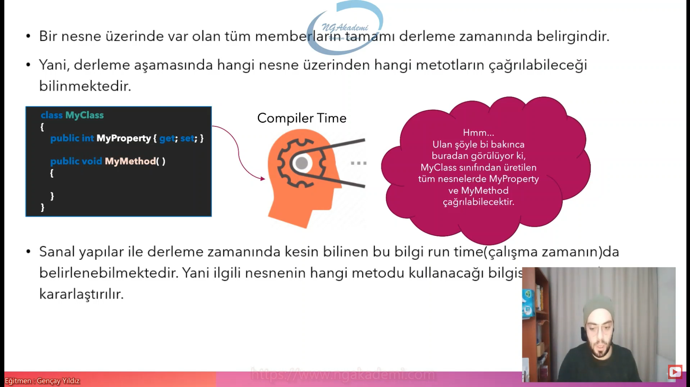
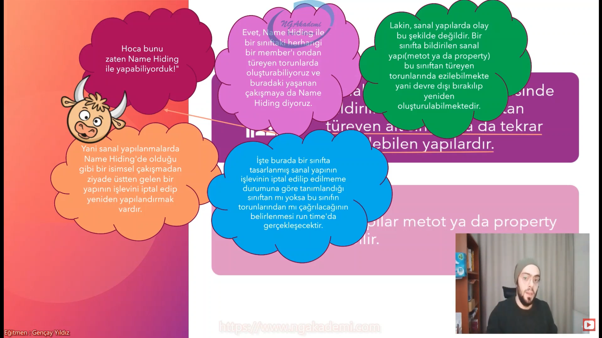
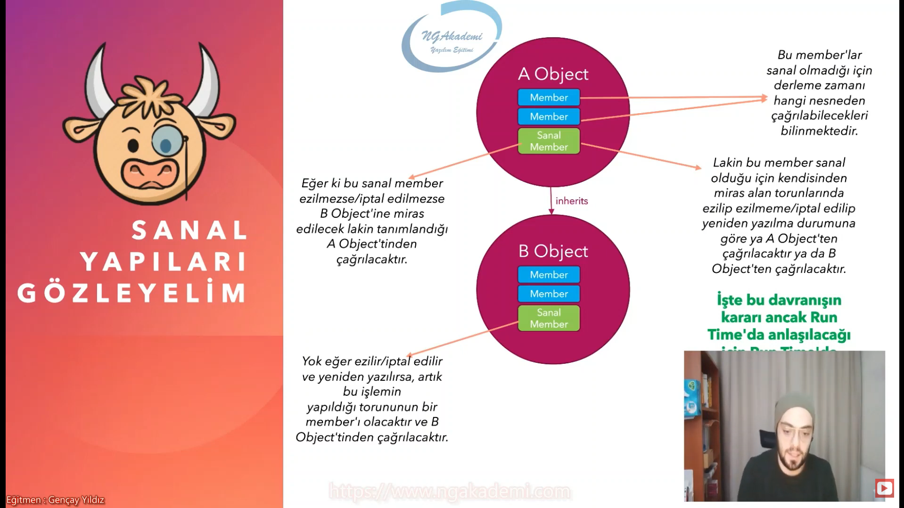
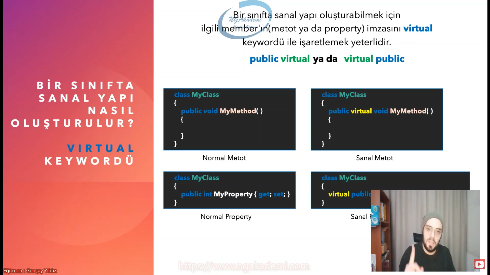
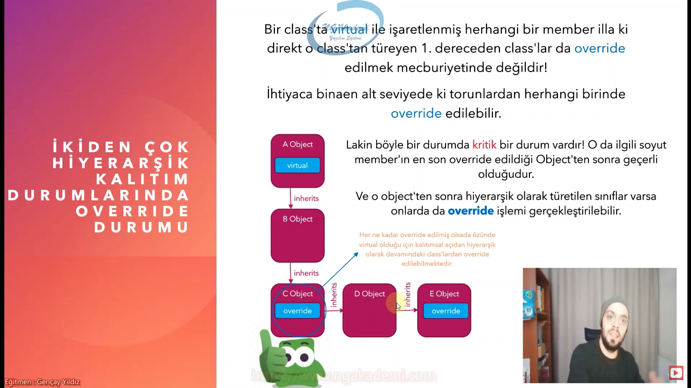

# Sanal Yapılar (virtual - override)




## Sanal Yapılar Nedir

* Sanal yapılar, bir sınıf içerisinde bildirilmiş olan ve o sınıftan türeyen alt sınıflarda da tekrar bildirilebilien yapılardır.
* Bu yapılar metot ya da property olabilir.



## Sanal Yapıları Gözlemleyelim




* İşte by davranışın kararı ancak Run Time'da anlaşılacağı için Run Time'da bunun kararı veriler
* Sanal yapılarda çağrılan member'ın hangi türe ait olduğu Run Time'da belirlenir...
* Vee unutmayalım! Metot ya da property fark etmez! Bir sanal member'ın hangi türe ait olduğunun bu şekilde run time'da belirlenmesine Geç Bağlama(Late Binding) denir!

## Sanal Yapılar Ne İçin Kullanılır?

* Gerçek hayattan şöyle örnek verelim, diyelimki babam çok sinirli bir adam ve bu gen babamda var banada aktarılmış lakin ben diyroumk iben kendimi kontrol edecem sinirli olmayacam babamdan gelen bu özelliği ezicem işte tam oalrak budur.
* Yazılımsal oalrakta, bir sınıfta tanımlanmış olan herhangi bir member'ın kendisinden türeyen alt sınıflarda Name Hiding durumuna düşmemeksizin ezilip/yeniden yazılıp yapılandırılması için kullanılır.
#### Pekiii bu zorunlu mudur ??
* Yani bir sanal yapı illa ki kendisinden türeyen torunlarda ezilmek/yeniden yazılmak zorunda mıdır?
* Tabi ki de hayır! Yani bir member sanal yapıldı diye illa ki kendisinden türeyen alt sınıflarda ezilmek zorunda değildir! Ama ezilmek istenirse de Name Hiding'e bulaşmadan direkt ilgili sınıfın bir member'ı olacak şekilde çalışılmasını sağlamış olur.

## Bir Sınıfta Sana Yapı Nasıl Oluşturulur? virtual Keywordü



## Sanal Yapılar Nasıl Ezilir? override Keywordü


* Bir class'ta __virtual__ ile işaretlenerek sanal hale getirilmiş bir member(metot ya da property), bu class'tan miras alan torunlarında ezilmek/yeniden yazılmak isteniyorsa eğer ilgili class'ta imzası __override__ keywordü işaretlenmiş bir vaziyette tekrardan aynı member oluşturulur
```csharp
class MyClass
{
    public virtual void MyMethod()
    {

    }
}
class MyClass2 : MyClass
{
    public override void MyMethod()
    {

    }
}
```
* Base class'ta ya da atalarda __virtual__ ile işaretlenerek sanallaştırılmış herhangi bir member torunlarda illa ki __override__ ile ezilmek zorunda değildir.
* Ama bir torun class base class'ta ki herhangi bir member'ı __override__ edecekse eğer o member'ın kesinlikle __virtual__ ile işaretlenmiş olması gerekmektedir.
* __virtual__ ile işaretlenmemiş bir member kesinlikle __override__ edilemez
* __virtual__ bir member'ın __override__ ile ezilmesine direkt olarak __"override etmek"__ diyeceğiz.
* __"override"__ keywordünü ileride Abstract Class'ların implementasyounda da kullanacağız. Şimdilik ne olduğunu salla :) Zamanı gelince konuşacağız.

## İkiden Çok Hiyerarşik Klaıtım Durumlarında Override Durumu




## Sanal Yapılar Hakkında Özet

* Sanal yapılar OOP'de Poliformizim'i uygulayan yapılardır.
* Sanal yapıların en önemli özelliği Late Binding'dir.
* Eğer bir member sanal olarak bildirilmemişse derleyici nesnelerin tür bilgisinden faydalanarak derleme zamanında hangi nesnede ilgili member'ın çağrılacağını bilir.
* Eğer bir member sanal olarak bildirilmişse, ilgili member'ın hangi nesne üzerinden çağrılacağı run time'da belirlenir.
* Hangi member'ın run time'da belirlenmesine Late Binding denir.
* Sanal yapı oluşturabilmek için ilgili member'ı virtual keywordü ile işaretlemeliyiz.
* Türeyen sınıflarda sanal yapıyı ezebilmek için override keywordü kullanılır.
* Türeyen sınıfsal yapıları override etmek zorunda değildirler.
* Static yapılanmalar sanal olarak bildirilemezler.