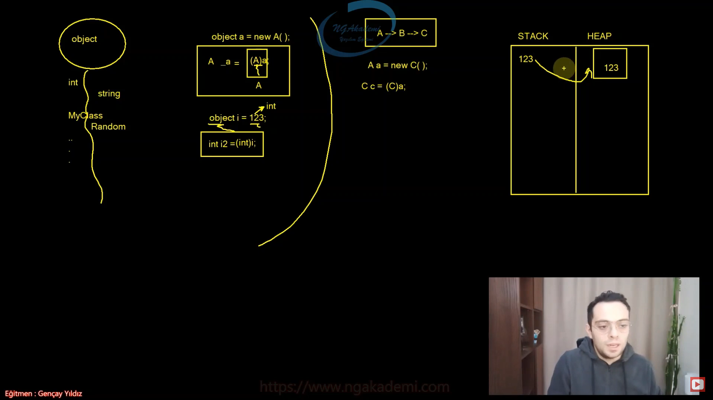

# Polimorfizm Part 2

* Poliformizim ufaktan hatırlayalım. Polimorfizm; bir nesnenin birden fazla farklı türde referanla işaretlenmesine denir.

## Polimorfizm Türleri

    * Statik Polimorfizm
    * Dinamik Polimorfizm
    
## Static Polimorfizm

* Static, ileride göreceğimiz bir kavramdır.
* Şimdilik sadece Polimorfizm çerçevesinde Static Polmorfizm'i değerlendireceğiz.
* Static Polimorfizm; derleme zamanında sergilenen polimorfizm'dir. Hangi fonksiyonun çağrılacağına derleme zamanında karar verilir.
* C# 'da statit polimorfizm deyince aklımıza __Metot Overloading__ terimi gelmelidir.
* __Metot Overloading__; aynı isimde birbirinden farklı imzalara sahip olan metotların tanımlanmasıdır. Ya da başka deyişle bir isme birden fazla farklı türde metot yüklemektir. Haliyle burada bir metodun birden fazla formunun olması __polimorfizm__'ken, bunlardan kullanılacak olanın derleme zamanında bilnmesi __statik polimorfizm__ olarak nitelendirilmektedir.
```csharp
class Matematik
{
    public long Topla(int s1, int s2)
        => s1 + s2;
    public long Topla(int s1, int s2, int s3)
        => s1 + s2 + s3;
    public long Topla(int s1, int s2, int s3, int s4)
        => s1 + s2 + s3 + s4;
}
```

## Dinamik Polimorfizm

* Dinamik Polimorfizm; çalışma zamanında sergilenen polimorfizm'dir. __Yani hangi fonksiyonun çalışacağına run time'da karar verilir.__
* C#'da dinamik polimorfizm deyince akla __Metot Override__ gelmektedir
* __Metot Override__; base class'ta virtual olarak işaretlenmiş metotların derived class'ta override edilerek ezilmesi/yeniden yazılması işlemidir. Haliyle burada aynı isimde birden fazla forma sahip fonksiyonun olması __polimorfizm__'ken bunlardan hangisinin kullanılacağının çalışma zamanında bilinmesi __dinamik polimorfizm__ olarak nitelendirilmektedir.


--- 

## Polimorfizm Durumlarında Tür Dönüşümleri

* Polimorfizm, OOP'de bir nesnenin kalıtımsal açıdan ataları olan referanslar tarafından işaretlenebilmesidir. Haliyle ilgili nesne, bu ataları olan referans türlerine göre dönüştürülebilmektedir.

```csharp
class A
{
    public string X{get; set;}
}
class B : A
{
    public string Y{get; set;}
}
class C : B
{
    public string Z{get; set;}
}

A a = new C();
```
* Yukarıdaki bu nesne A referansında tutulan/işaretlenen/referans edilen bir C türünden nesnedir.
* Haliyle ihtiyaç doğrultusunda A referansı üzerinden diğer kalıtımsal ilişkide olduğu referanslara yahut kendi referansında dönüştürülebilmelidir.

```csharp
C c = (C)a;
// a nesnesi C türüne cast edildi
```
* Misal olarak, burada görüldüğü üzere A türünden olan a referansındaki özünde C türünden nesne kendi türünden bir referansla işaretlenmiştir.
* Dikkat ederseniz bu işlem için Cast operatörü kullanılmaktadır.
* Bu durumun terside geçerlidir. Yani ilgili nesne kendi türünden kalıtımsal olarak ataları olan diğer türlere Cast edilebilir.
```csharp
C c = new C();
A a = (A)c;
```
* Dikkat edersen eğer Polimorfizm durumlarında kalıtımsal açıdan üst bir referans ile işaretlenebilmiş herhangi bir nesneyi kendi türünden işaretleyebilmek için Cast operatörünü kullanarak object türüne özel olan UnBoxing'e benzer bir hamlede bulunmuş oluyoruz.
* Buradan anlıyoruz ki, object türünde gerçekleştirilen UnBoxing durumu esasında object türü ile gerçekleştirilebilen Polimorfizm'in sonucudur...



##### Polimorfizm durumlarında tür dönüşümünü gerçekleştirebilmek için <span style="color: red;">Cast</span> ya da <span style="color: red;">as </span>operatörleri kullanılabilir.

### Cast

* Üst türden alt türe kalıtımsal ilişkide dönüşüm sağlar

```csharp
A a = new C();
C c = (C)a;
```
* Eğer ki, kalıtımsal ilişki olmayan herhangi birr türe dönüştürülmeye çalışılırsa derleyici hatası verecektir.
* Yok eğer kalıtımsal ilişkide olup fiziksel nesnenin hiyerarşik olan bir türe dönüştürülmeye çalışılırsa run time hatası verecektir.
```csharp
A a = new C();
D d = (D)a;
```
* Misal D türü A'dan kalıtım almıyorsa eğer hiyerarşide yer edinmeyecğinden dolayı bu durumda derleyici hatası verecektir. Yok eğer kalıtımsal olarak C'nin altında A'nın torunu ise fiziksel C nesnesinin kendisinden küçük olan D referansıyla işaretlenmesi Polimorfizm mantığı gereği mümkün olamayacğı için run time hatası verecektir.
* Tersine olarak, kalıtımsal ilişkide alt türden üst türe cast operatörü ile de bir dönüşüm sağlamaktadır.
```csharp
C c = new C();
A a = c;
A a2 = (A)c; // bu gereksiz.
```
* Yukarıda da yine kalıtımsal ilişki gerekmete aksi taktirde derleyici hatası ile karşılaşılabilmektedir.

### as

* Cast gibi kalıtımsal ilişki olan türler arasında referans dönüşümü yapabilmemeizi sağlayan operatördür.

```csharp
A a = new C();
C c = a as C;
```
* Dönüşüm esnasında hiyerarşik olarak tüm türlere dönüşüm sağlar. Lakin kalıtımsal ilişkide olunmayan türlerde derleyici hatası verecektir.
* Ya da kalıtımsal ilişkide olup fiziksel nesnenin türünden daha alt hiyerarşide olan nesnelere dönüştürülmeye çalışıldığında Polimorfizm mantığı gereği ilgili referans o nesneyi karşılayamayacağından __run time hatası VERMEYECEK!__ geriye <span style="color: red;">null </span> dönecektir.
```csharp
A a = new C();
D d = (D)a; // bu runtime hatası verir
D d = a as D; // bu d yi null döndürür.
```
* __Cast__ operatörünün __as__ operatöründen farkı; biri dönüşüm sağlanamıyorsa hata fırlatırken __(cast)__ diğeri null dönmektedir __(as)__.

### is

* is operatörü kalıtımsal ilişkiye sahip nesnelerin Polimorfizm özelliğine nazaran fiziksel olarak hangi türde olduğunu veren bir operatördür.

```csharp
A a = new C() { X = "1", Y = "2", Z = "3" };
Console.WriteLine(a is A); // TRUE
Console.WriteLine(a is B); // TRUE
Console.WriteLine(a is C); // TRUE
Console.WriteLine(a is D); // FALSE
```
* Haliyle dikkat ederseniz fiziksel nesnenin kalıtım hiyerarşisine uygun olan türlere 'true' olmayan türlere ise 'false' sonucunu döndürmektedir. Kalıtımsal ilişki olmayan sınıflara yapılacak kontrolde de beklenildiği gibi 'false' değeri döndürecektir.
* Haliyle çok biçimlilik uygulanmış bir nesnenin doğrultusunda(uygun olan) farklı bir ütre dönüştürülebilmesi için işi garantiye alabilmek adına önce <span style="color: red;">is </span> kontrolü ardından <span style="color: red;">cast </span> ya da <span style="color: red;">as </span>operasyonu sağlanması kafidir.

```csharp
A a = new C();
if(a is D)
{
    D d = (D)a;
}
else if (a is C)
{
    //.
}
```
