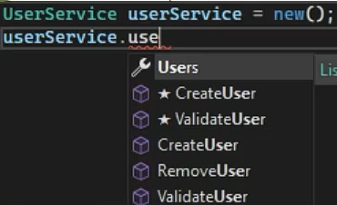
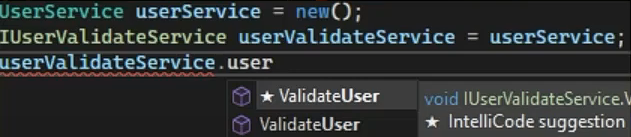

# Abstraction

## Abstraction Nedir?

* Abstraction bir mantıktır! Bir davranıştır.
* Kullanıcı işlemlerinden sorumlu olan bir sınıf düşünelim.
```csharp
class UserService
{
    public void CreateUser(UserInfo userInfo)
    {
        //..
    }
    public void RemoveUser(int userId)
    {
        //..
    }
    public List<User> Users{ get; set;}
    public void ValidateUser(UserInfo userInfo)
    {
        //..
    }
}
```

* Bu sınıfı kullanarak bir kullanıcı doğrulaması gerçekleştirmek istediğimizi varsayalım.
* Bu işlem için ilgili sınıftan üretilen instance'a ihtiyacımız olduğu aşikar öyle değil mi?


* Kullanıcı doğrulaması yapmak istiyoruz ama o da ne! Doğrulama işlemininn dışında bu sınıftaki kullanıcı işlemlerince dair tüm member'lar karşımızda
* Sizce, kullanıcı doğrulaması yapmak istediğimiz bir anda doğrulama işleminin dışındaki member'ların gelmesi ne kadar sağlıklı?
* Değil dimi! Ne de olsa kullanıcı burada doğrulama işlemi yapacaksa sadece doğrulamaya dair member'lara erişebilmesi en ideali olsa gerek...
* Yani bu durumu şöyle de düşünebiliriz. Bir tesisatçının iş yaparken o anda ihtiyacı olan aletlerin dışındakileri gözünün önünden kaldırması işini kolaylaştıracaktır.
* İngiliz anahtarı ve penseyle çalışacağı yerlerde, elinin altında türlü türlü aletlerin olması iş konsatrasyonunu negatif etkileyecektir.
* Aynı mantık yazılımcılar için de söz konusudur. O anda ihtiyaç dışı member'ların arasından yapılacak işe odaklı member'ları ayırt etmek yazılımcılar açısından sıkıntılı bir durumdur.
* Ki yazılımcı ister istemez yanlış metodu seçebilir yahut konuyla alakasız member'lar konsatrasyonu bozabilir.
*  İşte bu tarz durumlara karşın, kodun daha idealize olması için göstereceğimiz davranışa Abstraction denmektedir.

## Abstraction'ın Özeti Nedir?

* Gerekli olanları göster, gereksiz olanları gösterme!
* Abstraction, bir sınıf member'larından ihtiyaç noktasında alakalı olanları gösterip, alakasız olmayanları göstermemek demektir.

## Abstraction Nasıl Uygulanır?

* Abstraction'ın interface'ler yahut abstract class'lara doğrdan hiçbir ilgisi alakası yoktur.
* Bir operasyon anında, kullanılacak sınıfın sadece o anki operasyona uygun member'larını getirebilmek için(yani abstraction'ı uygulayabilmek için) ilgili member'ları temsil edebilecek bir referansa ihtiyacımız olacaktır.
* Bunu normal sınıflarla öyle ya da bölye gerçekleştirebilirsiniz lakin bu davranışı uygularken sadece interface'ler yahut abstract class'lar diğer yapılara göre daha elverişli olabilmektedirler.
* Hele hele sınıfların birden fazla interface ile implement edilebilmeleri, ilgili sınıfın birden fazla referansla refere edilebilmesi anlamına geleceğinden dolayı, interface'lerin abstraction işlemi için oldukça yaygın olarak kullanılan yapılan olduğunu düşünebiliriz.
```csharp
interface IUserValidateServer
{
    bool ValidateUser(UserInfo userInfo);
}
interface IUserProcessService
{
    void CreateUser(UserInfo userInfo);
    void RemoveUser(int userId);
    List<User> Users {get; set;}
}
class UserService : IUserValidateServer,IUserProcessService
{
    public void CreateUser(UserInfo userInfo)
    {
        //..
    }
    public void RemoveUser(int userId)
    {
        //..
    }
    public List<User> Users{ get; set;}
    public BOOL ValidateUser(UserInfo userInfo)
    {
        //..
    }
}
```
<div style="display: flex; justify-content: space-between;">
  
  
</div>

* Görüldüğü üzere 'UserService' sınıfı içerisindeki member'lar ihtiyaca binaen interface referansları aracılığıyla ayrıştırılabilmekte ve abstraction davranışı böylece gerçekleştirilebilmektedir.
* İşte bu mantıkla olayı değerlendirdipimzde abstraction davranışı için interface'leri veya abstract class'ları kullanıyoruz. Aksi taktirde bu davranış akla direkt interface ve abstract class getirmektedir ki, yanlıştır!
* Bir de dikkat ederseniz eğer abstraction davranışı; member'ları ayıkladığı/gizlediği için 'encapsulation', kalıtımsal işlem gerektirdiği için 'inheritance' ve farklı referanslar kullandırdığı için 'polimorfizm' kavramlarıyla doğrudan bağlantılı bir davranıştır.

## Abstraction'ın Etkisi Nedir?

* Nasıl yaptı bilmiyorum, sadece yapabildiğini biliyorum...
* Abstraction davranışının uygulandığı noktalarda, ilgili nesnenin işlevi nasıl yaptığından öte, ne yaptığıyla ilgilendiğimizi ifade etmiş oluyoruz.
* Bunu da genellikle interface'ler kullanarak bu davranışı gerçekleştirdiğimizden dolayı söyleyebiliyoruz.
* İlgili interface, bizlere refere ettiği instance'da ki o niteliği imza olarak söylemekte ama nasıl bir işlevsellik gösterdiğine dair bilgi vermemektedir.
* Dolayısıyla abstraction, nesnenin işleri nasıl yaptığını değil, hangi görevleri yapabileceğini söylememizi sağlamaktadır.
* Bu durumdan da şu sonucu çıkarabiliriz ki; abstraction, bir sınıfın belirli bir davranışa sahip olduğunun garantisini sağlamaktadır.
* Yani X,Y ve Z davranışlarına sahip olan bir sınıfın, abstraction ile sadece Y member'ı erişilebilir hale getiriliyorsa bu durumda kesinlikle bu sınıfta Y davranışının olduğu garanti ediliyor anlamına gelmektedir.
* Bu garantiyi, ilgili sınıfa abstraction mantığını interface yahut abstract class'larla uyguladığımızda implemenrasyon zorunluluğu neticesinde sağlayabiliyoruz.

## Abstraction'ın Ana Hedefi Nedir?

* Bir nesnenin yalnızca o anki duruma göre ilgili davranışları gösterilmekte, gereksiz ayrıntıları gizlenmektedir.
* Abstraction'ın amacı, geliştriciden bir sınıfa karşın olabilecek gereksiz ayrıntıları gizleyerek karmaşıklığın üstesinden gelmektir.
* O sınıftan üretilmiş bir instance'ı kullanırken o instance'ın sadece ne yapabileceğini göstermek lakin nasıl yapabileceği hakkında bilgi vermemektir.
* Ayrıca yerine göre uygulama ayrıntılarını gizleyerek sadece ilgili davranışların erişilebilir olmasını sağlamakta abstraction'ın bir hedefidir diyebiliriz.

## Abstraction'a Örnek Senaryolar Verelim

* Abstraction, hayatın içinden bir davranıştır.
* Senaryo 1:
    * Amazon hesabına giriş sürecinde kullanılacak bir nesneyi düşünürsek eğer bu nesnenin o anda bizlerden sadece username ve password'ü alacak metoduna erişebilmemiz ve diğer konulardan alakasız metotlarına erişmememiz bir abstraction davranışı neticesidir.
* Senaryo 2:
    * Bir araba birçok parçanın bir araya gelerek bütünsel olarak işlemesi neticesinde işlevsellik göstermektedir. Lakin Şoför için araba sadece bir arabadır, yani şoför açısından arabanın motorunda dönen tüm fiziksel kurallar soyutlanmıştır. Şoför arabanın nasıl çalıştığını bilemeyebilir lakin çalıştığını bilir. İşte bu abstraction'dır.
* Senaryo 3:
    * Evlerimizdeki prizler ve o prizlere takılan fişler arasında bir abstraction durumu söz konusudur. Bir prizin görevi kendisine takılan fiş üzerinden ilgili cihazlara elektrik göndermektir. Tabi bir prize birden çok fiş takılabilir amma velakin priz hangi cihaza bağlı olduğunu asla bilemez. Burada priz açısından elektrik göndereceği cihazın detayları fiş sayesinde soyutlanmıştır. Priz sadece kendisine takılacak fişi bilir. Belki bu akla dependency inversion prensibini de getirebilir :) Doğrudur, bir yandan da bir abstraction örneğidir.
* Senaryo 4:
    * Sabahları uyandığımızda ayılmak için genellikle kahve tüketiriz. Mutfağa gidip kahve makinesinin düğmesine basarız ve kahveyi yaparız. Bunu yapabilmek için kahve makinesinin nasıl kullanılacağını bilmenin dışında su ve kahve çekirdeği koymamız yeterli olacaktır. Bunların dışında; suyun ideal sıcaklığı, öğütülmüş kahve miktarı, makineyi çalıştırılması için gerekli elektrik voltajı vs. gibi ekstradan bilgilere ihtiyacınız muhtemelen olmayacktır. Bir kişi, kahve yapabilmek için gerekli olan tüm bu kaygıları ortadan kaldırabilmek için kahve makinesini yapmıştır. Böylece sizlerin kahve yapma sürecinde uygulayabileceğiniz davranışlar gereksiz detaylardan soyutlanmıştır.
