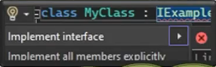

# Interface Part-I

## Interface Nedir?

* Programlama süreçlerinde interface yapılanması, nesnelere direkt olarak bir arayüz/şablon oluşturulmasını ve bu arayüz üzerinden geliştirici ile nesne arasındaki etkileşimin daha da kolaylaştırılmasını sağlayan bir araçtır.
* Hatta sadece geliştirici ile nesne arasındaki süreci kolaylaştırmamakta, ayrıca bir porgraın farklı bir programla yahut bileşenle etkileşimini de kolaylaştırmaktadır.
* __Peki bu ne anlama gelmektedir?__
* Interface'in nesneye bir arayüz sağlaması, kullanıcı açısından, ilgili nesnenin nasıl çalıştığına dair ayrıntılı bilgiye ihtiyaç duyulmaksızın, sadece arayüzün sunduğu fonksiyonları veya property'leri kullanarak etkileşime girilmesini sağlar.
* Yani anlayacağımız interface, o nesneye bir abstraction uygulayarak, belirlenmiş bir arayüz üzerinden çalışılmasını ve böylece ilgili nesne ile geliştirme sürecinin kolaylaştırılması sağlamaktadır.
* Biz bu abstraction işlemini abstract class'la da gerçekleştiriyorduk! Interface'in bundan farkı nedir?
* Abstraction'ı abstract class ile gerçekleştirebiliyoduk. Amma velakin, abstract class'lar da bir nesnenin içerisindeki imzaları modellemenin dışında farklı işlemleride gerçekleştirebiliyordu! Bu duruma istinaden dil geliştiricileri daha sade ve sadece imzalara konsantre olmuş bir yapıya olan ihtiyacı hissettiler ve interface yapısını ortaya koydular diyebiliriz.
* Interface, abstract class'ın sadece imzalara konsantre olmuş halidir! O yüzden abstraction davranışı açısından abstract class'a nazaran daha elverişlidir.


## Interface'in Genel Davranışı | Can-Do İlişkisi

* Bizler bir sınıfta olmasını istediğimiz member'ları oluşturmadan önce bir interface'de bu member'ların imzalarını tanımlayarak bir şablon oluşturuyoruz.
* Ardından bu şablonu/interface'i kullanarak sınıfta member'ları tanımlıyoruz.
* Bir sınıf, bir interface kullanıyorsa eğer aynen abstract class'lar da ki abstract elemanlarda olduğu gibi içerisindeki member'ların uygulanmasını/tanımlanmasını zorunlu kılmaktadır.
* Anlayacağınız interface, bir sınıf içerisinde tanımlanacak member'ların kendi içerisindeki imzaların olacağının taahüdünü vermektedir!
* İşte bizler de bu taahüdden interface'in can-do ilişkisi/davranışı sergilediğini gözlemlemekteyiz.
* Intercae, bir class içerisinde tanımlanacak member'ları zoraki uygulattırdığı için o member içerisinde hangi davranışların, işlevlerin yani yeteneklerin olabileceğini özetlemektedir.
* Yani bir interface'e bakıldığında, o interface'i uygulayan sınıfların neler yapabileceği(can-do), hangi yeteneklere sahip olabileceği hakkında rahatlıkla yorumda bulunabilmektedir.
* İşte bu durumda interface'lerin yapısal olarak nesnelere can-do ilişkisi kurduğunu göstermektedir.

__Interface, biz sözleşmedir!__


## Interface'i Neden Kulanıyoruz?

* Farklı nesneler veya bileşenler arasında iletişimi kolaylaştırmak, bir standarta tabi kılmak, birbirleriyle uyumlu hale getirmek için..
* Sistemin ve mimairinin modüler bir şekilde tasarlanabilmesi için...
* Farklı geliştiricilerin ve ekiplerin söz konusu olduğu çalışmalarda belirlenmiş bir arayüz üzerinden sınıfların tasarlanmasını sağlayarak, dökümantasyon gerektirmeksizin programatik kurallar koyabilmek için...


## Tanımlama ve İnşa Etme Kuralları

```csharp
interface IExample
{

}
```
* Bir interface tanımlayabilmek için __interface__ keyword'ünden yandaki gibi istifade etmekteyiz.
* Bu yapılan tanımlama neticesinde artık IExample adında bir interface oluşturulmuş olacaktır.
* Ve unutmayalım, Interface'ler referans türlü değişkenlerdir. Yani bir referanstır.
* Bu mantıkla olayı değerlendirdiğimizde yandaki tanım gereği artık ilgili programda IExample adında bir referans türüde oluşturulmuştur diyebiliriz.
* Ayrıca şunu da bilmemizde fayda var ki; C# programlama dilinde bir interface'e isim verirken adınının __I__ ile başlaması name conventions dediğimiz gelenektendir.
* Bu gelenek sayesinde geliştirici açısından I ile başlayan bir referansın interface olduğu direkt IntelliSense'da anlaşılacak ve geliştiricinin işi kolaylaştırılacaktır.
* Bir interface'i nerde tanımlayabilirsek diyede sorarsak eğer; Bir class nerede tanımlanabiliyorsa interface'de orada tanımlanabilir. Herhangi bir namespace, class, struct yahut interface içerisinde interface tanımlanabilir. Ya da istersenin namespace dışında da tanımlama yapabilirsiniz.


## Interface İçerisinde İmzaların Oluşturulması

```csharp
interface IExample
{
    void AMethod();
    int BMethod();
    int CProperty {get; set;}
}
```

* Görüldüğü üzere interface içerisinde metot ve property imzaları tanımlanabilmektedir.
* İmza tanımlama sürecinde Access Modifier eşliğinde metot ve property'lerin gövdeleri tanımlanmaz! Sadece imzaları tanımlanır.
* Ve ayrıca dikkat edersek abstract class'lar da olduğu gibi imzalar abstract keywordü eşliğinde de TANIMLANMAMAKTADIR! Abstract class'lar içlerinde derived class'lara miras olarak aktarılacak memberların eşliğinde biryandan da zoraki uygulatılacak member'ları barındırabildiği için bu farkı abstract keyword'ü ile ortaya koymaktadırlar. Lakin interface'ler sade ve sadece sınıflara uygulatılacak imzaları barındırdıkları için bu şekilde bir ayrıma gereksinim görülmemiştir!
* Ayruca interface içerisinde __field__ tanımının mümkün olmadığını bilmenizde fayda vardır!
* Bunun nedeni, field'ların metotlar ve property'ler tarafından operatif olarak kullanılmalarıdır. Haliyle metotların yahut property'lerin kullanılacakları operatif değişkenleri tanımlamak ihtiyaç sürecinin parçası olacağı için interface içerisinde tanımlanmları gereksiz/saçma olacaktır. Bu yüzden field tanımı yasaklanmıştır!

## Interface Kullanımı

* Interface'i kullanabilmek için kalıtım sürecinde kullandığımız __:__ operatöründen aşağıdaki gibi istifade etmekteyiz.
```csharp
class MyClass : IExample
{
    public void AMethod()
    {
        //..
    }
    public int BMethod()
    {
        //..
    }
    public int CProperty{get;set;}
}
```
* Yukarıdaki gibi bir implementation neticesinde MyClass içerisine IExample interface'i içerisindeki imzalar, gövdeleriyle birlikte zoraki uygulatacaktır.
* Dikkat edersek sanki kalıtım alıyormuş gibi : operatörü eşliğinde interface'i kullanabiliyoruz.
* Burada : operatörü eşliğinde interface kullanıldığı için artık bu kalıtım operatörü değil, uygulama/implementation operatörü olarak nitelendirilecektir.
* Ya da bir başka deyişle : operatörüyle birlikte kullanılan yapı bir class değil de interface ise işte o zaman ilgili operatör implementation görevi görecektir.
* Implementation nedir diyorsanız;
* Implementation, herhangi bir class'a herhangi bir interface veya abstract calss'ın ':' operatörü ile şablon/arayüz olarak sağlanmasıdır.
* Ya da başka bir deyişle, bir class'a başka bir class'tan kalıtım alıyorsa buna inheritance, yok eğer interface'den kalıtım alıyorsa buna implementation denir.
* Çünkü, bir class'a interface'in uygulanması demek, o interface içerisindeki imzaların, o class'a zoraki dayatılması demektir. Haliyle bu eylemin nihai olarak kalıtımsal bir davranıştan ziyade, 'uygulama'/'implementasyon' davranışıdır! O yüzden bu şekilde bir terminalojik betimleme yapılmaktadır. Hatırlasanız eğer abstract class'lar içerisinde abstract ile işaretlenmiş olan member'ların derived class'lara zoraki uygulatılmaına da implementation diyorduk! Çünkü her iki durum da aynı mantıktan beslenmektedir.
* Yanlız buradaki implementasyonun neticesinde uygulanan member'ların imzalarında abstract class'lar dan yapılan implementation'da ki gibi override durumu söz konusu değildir.

## Interface Implementation Yöntemleri

* Bir interface'i herhangi bir class'a implemente ederker; implement, explicity implement ve ameleus olmak üzere üç farklı yöntemden birini kullanabiliriz.

* Ameleus
    * Interface'de ki imzaların karşılığını class'a manuel bir şekilde oluşturma yöntemidir.
    * Vira bismillah bileğe kuvvet diyerek yapılır.
* implement
    * Visual Studio editörü aracılığıyla implemetasyonun yapılmasını sağlayan yöntemdir.
    * İmplementasyonun yapılacağı satırda yanda çıkan ampul simgesine tıkalndığında ya da ilgili satırda CTRL + . kombinasyonunun kullanılması neticesinde çıkan küçük ekrandaki 'Implement interface' sekmesine tıklanılması yeterlidir.
* explicity implement
    * Yine Visual Studio editörü aracılığıyla implementasyonun yapılmasını sağlayan yöntemdir.
    * Bu yöntemde de açılan küçük pencerede 'Implement all members explicity' sekmesine tıklayarak davranış gerçekleştirilmektedir. Bu yöntemin detaylarına dersimizin devamında Name Hiding başlığı altında gireceğiz.

        

## Interface'ler de Çoklu Kalıtım Durumu

* C#'ta malumumuz, bir sınıf sade ve sadece tek bir sınıftan kalıtım alabilmektedir.
* Lakin bir sınıf aynı anda birden fazla interface'i uygulayabilmektedir.
```csharp
class MyClass : IA,IB,IC
{
    //...
}
```
* Bu yapılar interface olduğu sürece bu tanımlama mümkünür.
* Bu şekilde çoklu implementasyon durumlarında tüm interface'ler ilgili class'a implemente edilecektirler.
* Ayrıca dersimizin devamında inceleyecek olsakta tüm bu interface referansları tarafından ilgili class'ın instance'ını refere edebileceğimizi bu noktada da söylemekte fayda görmekteyim.

## Interface'in Interface'den Türemesi

* Interface'leri de kendi aralarında birbirlerinden türetebilmekteyiz.
* Eğer ki bu şekilde interface'in interface'e kalıtım vermesi durummu söz konusuysa burada : operaötrü implementation değil __'inheritance'__ görevi görecektir ve bu interface'leri birbirlerinden türetecektir.

```csharp
interface IA
{
    void A();
}
interface IB:IA
{
    void B();
}
interface IC:IB
{
    void C();
}
```

* Haliyle kalıtımın tüm kuralları bu noktada geçerli olacaktır ve hiyerarşik olarak interface'lerin member'ları torunlarına aktarılacaktır.
* Ayrıca polimorfizm kuralları geçerli olacak ve misal olarak IC interface'inin implemente edileceği class, tüm üst referanslar tarfından da işaretlenebilir olacaktır.
* Unutma !!! C# programlama dilinde bir class sade ve sadece tek bir class'tan türeyebilirken, bir interface, aynı anda birden fazla interface'den türeyebilmektedir.

## Bir Class'a Inheritance İle Birlikte Implementation Nasıl Uygulanır

* C#'ta bir class, farklı bir class'tan kalıtım alırken hem de bir yandan interface'i implement edecekse eğer önce class'tan kalıtım almalı, sonrasında da virgülle interface(ler) tanımlanmalıdır.

```csharp
class MyClass :ExampleClass,IA
{
    //...
}
```

