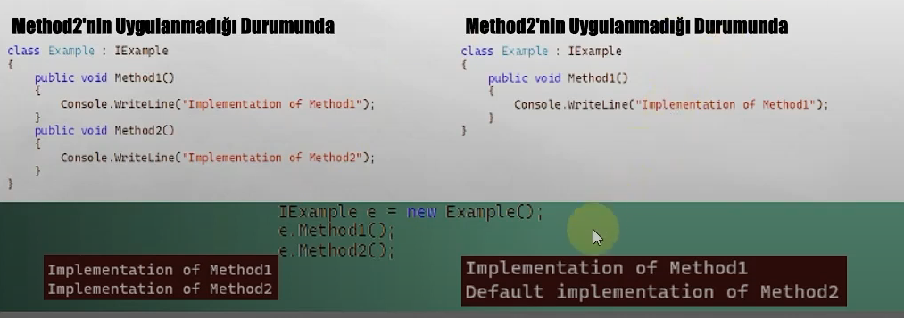

# Interface Part-II

## Explicity Implement & Name Hiding

```csharp
interface IArea
{
    double Calculate();
}
interface IPerimeter
{
    double Calculate();
}
class Claculator :IArea,IPerimeter
{
    public double Calculate()
    {
        //...
        return 0;
    }
}
```

* Bir sınıf, yukarıdaki gibi aynı imzaya/imzalara sahip iki interface'i implement ederse eğer bu durumda her iki interface'de ilgili member'ı ya da member'ları kendi implementasyonlarıymış gibi kullacanaktırlar
* Ancak bu tarz bir durumda, ilgili member'ı/member'ları interface'ine göre açıkça ayırmak isteyebilir ve operasyonlarınızı kullacılacak interface'e göre yürütmek isteyebilirsiniz.
* İşte bunu __Explicity Implmenet__ ile gerçekleştirebiliyoruz.

```csharp
class Claculator :IArea,IPerimeter
{
    double IArea.Calculate()
    {
        //...
        return 0;
    }
    double IPerimeter.Calculate()
    {
        //...
        return 0;
    }
}
```

* Görüldüğü üzere Explicity Implement'te member'ların hangi interface'den geldiği bu şekilde belirtilmekte ve böylece fark kodsal açıdan yaratılmış olmaktadır.
* Yalnız explicity implement edilen member'lar private olarak tanımlanmak mecburiyetindedirler
* Haliyle bu member'lara class referansı üzerinden değiil, ancak interface referansı üzerinden erişim gösterebiliriz.
* Birde fazla interface'de aynı isimde bulunan imzaların tek bir sınıfa uygulatılmasına __'Name Hiding'__ denmektedir.

```csharp
Calculator calculator = new();
IArea areCalculator = calculator;
IPerimetere perimeterCalculator = calculator;

areCalculator.Calculate();
perimeterCalculator.Calculate();

```

* Tabi burada name hiding'e düşen bu member'lardan istediğinizi normal bir şekilde implement ederekte direkt ilgili sınıf instance'ı üzerinden erişlilebilir hale getirebilir ve diğerlerini explicitiy implement edebilirsiniz.
```csharp
class Claculator :IArea,IPerimeter
{
    public double Calculate() // IArea
    {
        //...
        return 0;
    }
    double IPerimeter.Calculate() // IPerimeter
    {
        //...
        return 0;
    }
}
```

### Base Class'ta ki Herhangi Bir Member İle Interface İçerisindeki İmzalar Name Hiding Durumuna Düşer Mi?

* Hayır! Base class'ta bulunan herhangi bir member, interface içerisindeki bir imzayla uyuşuyorsa eğer, ilgili sınıfa o interface'in implementasyonu inheritance yöntemiyle gerçekleştirilecektir.

```csharp
class BaseClass
{
    public void Run()
    {
        Console.WriteLine("Base Class Run...");
    }
}
interface IRun
{
    void Run();
}
class MyClass : BaseClass,IRun
{

}
```
* Yani bu kod hata vermeyecek derlenecektir. Çünkü IRun içerisindeki 'void Run()' imzasına karşılık member 'BaseClass'tan kalıtımla 'MyClass' sınıfına aktarılmış ve böylece sözleşme gereği usul yerine getirilmiş olacaktır.


## Default Implementation

* Normal şartlarda interface yapılanması, içerisinde, sade ve sadece kullanılacağı class'lara uygulatacağı member'ların imzalarını barındırmaktadır. Ancak C# 8.0 sürümüyle birlikte interface içerisinde kimi member'ların varsayılan uygulamasını gerçekleştirebileceğimiz ve imzasını eşliğinde gövdesini de tanımlayabileceğimiz __Default Interface Implementation__ özelliği tanıtılmıştır.
* Bu özellik sayesinde artık interface içerisinde istediğimiz member'ların gövdelerini tanımlayabilir ve böylece implementation sürecinde bir opsiyonel durum ortaya koyabiliyoruz. Şöyle ki;

```csharp
interface IExample
{
    void Method1();
    void Method2()
    {
        Console.WriteLine("Default implementation of Method2");
    }
}
```

* Yukarıdaki interface tanımına göz atarsanız eğer içerisinde 'Method1' ve 'Method2' isimlerinde iki adet member göreceksiniz. Bu member'lardan ilki imza halindeyken, ikincisi default implementation yani varsayılan bir uygulama içeren yapıya sahiptir.
* Bu durumda herhangi bir class 'IExample' interface'ini implement ettiğinde 'Method1'i uygulamak zorundadır lakin 'Method2'yi uygulamayabilir. Böylece 'Method2'nin varsayılan uygulaması devreye girecektir.



* Bu default implementation denen olay interface yapılanmasının amacına aykırı değil mi diye düşünebiliriz
* Evet, default implementation özünde interface yapılanmasının varlık amacına aykırı olabilir. Yani bir interface varsa eğer bu interface'i kullanacak olan sınıftan, bu interface'i uygulaması/implementation beklenir! Madem beklenmeyecek o zaman zaten interface'in varlık amacının dışında bir durum söz konusudur!
* Default implementation ise bir interface'in uygulanmak istenmediği noktalarda default member'ları devrreye sokmaktadıır :( Bu durumda 'Madem uygulamak istenmeyecek o zaman neden interface kullanalım ki?' sorusu akıllara gelebilir.
* Default implememntation ne de olsa kimi durumlarda kullanışlı bir özellikte olabilir. Özellikle mimaride mevcut olan ve çok fazla noktada kullanılan bir interface'e yeni bir member eklemek bazen ciddi bir külfet doğurabilmektedir. İşte böyle bir durumda geriye dönük uyumluluk sağlayabilmek için defauly implementation özelliğinden istifade etmek, bizleri ortaya çıkabilecek maaliyetten büyük ölçüde törpüleyecektir.

## Beyin Fırtınası

* Sizce neden class'ların imzaları abstract class'lar değil de interface'lerdir?
    * Çünkü interface'lerin nesnelerinin üretilmemeleridir! Böylece implementation sürecinde abstract class yerine interface seçmek kaynak tüketimi açısından daha az maaliyetlidir.
* Neden abstraction'da interface tercih edilir?
    * Çünkü interface ile kullanıcıya bir sınıftaki var olan member'lardan sadece istenilenler gösterilir. Evet, bunu abstract class'lar ile de gerçekleştirebiliriz amma velakin interface'in tercih edilmesinin nedeni biryandan da impelementation sürecinde nesne üretip ekstradan maaliyeti arttırmaamsıdır.

## Interface'lerin İşaretleme Amaçlı Kullanılması

* Interface'lerin ne amaca hizmet ettiklerini ve neden kullanıldıklarını artık biliyoruz kanaatindeyim. Biz yazılı geliştiriciler tarafından interface'ler tüm bu vizyonunun dışında ekstradan yazılımdaki belirli instance'ları diğerlerinden ayırabilmek için işaretleme amaçlı da kullanabilmekteyiz.
* Misal olarak, bir uygulamadaki entity sınıflarını diğer sınıflardan ayırabilmek için IEntity isimli bir interface'le işaretleme davranışı gösterebiliriz. Ya da uygulamada loglama işlemi yapacak olan sınıfları diğerlerinden yine ayırabilmek için ILogger interface'i ile işaretleyebiliriz. Böylece yapıları davranışlarına yahut kurudaki rolüne göre interface'ler sayesinde gruplayabilir ve daha emin ve tip güvenli bir şekilde çalışmalar gerçekleştirebiliriz.
* Bu kullanıma esasında __Marker Interface Pattern__ adı verilmektedir.

__Interface'ler, class yahut abstract class'lar gibi kalıtım süreçlerinde ekstradan nesne oluşturmazlar! Bu yüzden abstraction ve marker(işaretleme) operasyonlarıdna class ya da abstract class'lara nazaran daha performanslı çalışırlar.__

